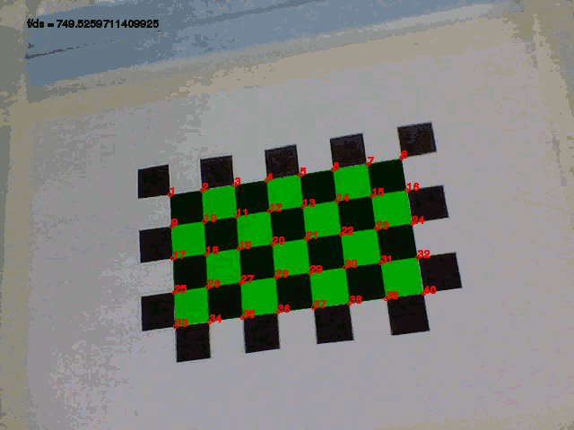

3D Vision
=========

Camera Calibration
------------------

The following program can be used to estimate the ratio of focal length to pixel size of a camera using a video showing a calibration grid. Note that it is necessary to specify how many corners there are for each dimension as follows:

    ruby calibration.rb 'calibration.avi' 8 5

The program for camera calibration can be downloaded here: [calibration.rb](calibration.rb)

See Also
--------

External Links
--------------

* [Zhengyou Zhang calibration](http://research.microsoft.com/en-us/um/people/zhang/calib/)

