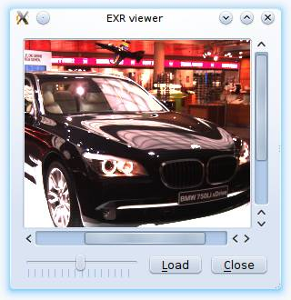

Applications
============

Video Thumbnails
----------------

EXR Viewer
----------

This is small viewer for displaying EXR images. The exposure can be modified with the slider.

The user interface was defined using Qt-Designer. The scroll area was defined by promoting a QFrame object to QScrollArea. See reference about using custom widgets for more information.

To use this application you need to install Qt4Ruby. You also need to compile the user interface description file first:

    rbuic4 exrviewer.ui > ui_exrviewer.rb

The UI file is available for download here: [exrviewer.ui](exrviewer.ui)

    require 'rubygems'
    require 'hornetseye_openexr'
    require 'hornetseye_rmagick'
    require 'hornetseye_qt4'
    require 'ui_exrviewer'
    include Hornetseye
    class EXRViewer < Qt::Widget
      slots 'load()'
      slots 'recompute()'
      def initialize( parent = nil )
        super parent
        @ui = Ui::EXRViewer.new
        @ui.setupUi self
        connect @ui.close_button, SIGNAL('clicked()'), self, SLOT('close()')
        connect @ui.load_button, SIGNAL('clicked()'), self, SLOT('load()')
        connect @ui.brightness_slider, SIGNAL('valueChanged(int)'),
                self, SLOT('recompute()')
        @arr = nil
        @channelmax = nil
        @label = Qt::Label.new
        @ui.scroll_area.setWidget @label
      end
      def load
        fileName = Qt::FileDialog.getOpenFileName self, "Load EXR File", "",
                                                  "EXR image (*.exr)"
        if fileName
          @arr = MultiArray.load_sfloatrgb fileName
          @max = proc { |x| [ x.r, x.g, x.b ].max }.call @arr.max
          @ui.brightness_slider.setEnabled true
          recompute
        end
      end
      def recompute
        factor = 2.0 ** ( @ui.brightness_slider.value / 4096.0 ) * 0xFF / @max
        image = ( @arr * factor ).minor( 0xFF ).to_ubytergb
        str = image.to_magick.to_blob do
          self.format = "PPM"
          self.depth = 8
        end
        pixmap = Qt::Pixmap.new
        pixmap.loadFromData Qt::ByteArray.fromRawData( str, str.size )
        @label.setPixmap pixmap
        @label.resize pixmap.width, pixmap.height
      end
    end
    app = Qt::Application.new ARGV
    viewer = EXRViewer.new
    viewer.show
    app.exec

XVideo Widget
-------------

Webcam Viewer
-------------

2D Plot
-------

3D Plot
-------

Depth from Focus
----------------

Line Fit
--------

PCA Recognition
---------------

Phase Correlation
-----------------

Normalised Cross-Correlation
----------------------------

Mean Shift Tracking
-------------------

Camshift Tracking
-----------------

Lucas-Kanade Tracker
--------------------

EAN-13 Barcode Reader
---------------------

See Also
--------

External Links
--------------

