Applications
============

Video Thumbnails
----------------

EXR Viewer
----------

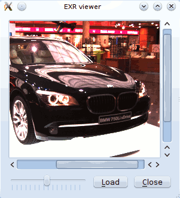

This is small viewer for displaying EXR images. The exposure can be modified with the slider.

The user interface was defined using Qt-Designer. The scroll area was defined by promoting a QFrame object to QScrollArea. See reference about using custom widgets for more information.

To use this application you need to install Qt4Ruby. You also need to compile the user interface description file first:

    rbuic4 exrviewer.ui > ui_exrviewer.rb

The UI file is available for download here: [exrviewer.ui](exrviewer.ui)

    require 'rubygems'
    require 'hornetseye_openexr'
    require 'hornetseye_rmagick'
    require 'hornetseye_qt4'
    require 'ui_exrviewer'
    include Hornetseye
    class EXRViewer < Qt::Widget
      slots 'load()'
      slots 'recompute()'
      def initialize( parent = nil )
        super parent
        @ui = Ui::EXRViewer.new
        @ui.setupUi self
        connect @ui.close_button, SIGNAL('clicked()'), self, SLOT('close()')
        connect @ui.load_button, SIGNAL('clicked()'), self, SLOT('load()')
        connect @ui.brightness_slider, SIGNAL('valueChanged(int)'),
                self, SLOT('recompute()')
        @arr = nil
        @channelmax = nil
        @label = Qt::Label.new
        @ui.scroll_area.setWidget @label
      end
      def load
        fileName = Qt::FileDialog.getOpenFileName self, "Load EXR File", "",
                                                  "EXR image (*.exr)"
        if fileName
          @arr = MultiArray.load_sfloatrgb fileName
          @max = proc { |x| [ x.r, x.g, x.b ].max }.call @arr.max
          @ui.brightness_slider.setEnabled true
          recompute
        end
      end
      def recompute
        factor = 2.0 ** ( @ui.brightness_slider.value / 4096.0 ) * 0xFF / @max
        image = ( @arr * factor ).minor( 0xFF ).to_ubytergb
        str = image.to_magick.to_blob do
          self.format = "PPM"
          self.depth = 8
        end
        pixmap = Qt::Pixmap.new
        pixmap.loadFromData Qt::ByteArray.fromRawData( str, str.size )
        @label.setPixmap pixmap
        @label.resize pixmap.width, pixmap.height
      end
    end
    app = Qt::Application.new ARGV
    viewer = EXRViewer.new
    viewer.show
    app.exec

XVideo Widget
-------------

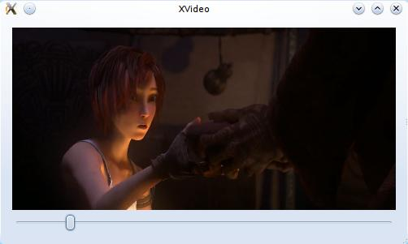

The XVideo widget allows to use XVideo acceleration in a Qt4-QtRuby application. The example application shows how to write a small program for playing videos.

    require 'rubygems'
    require 'hornetseye_ffmpeg'
    require 'hornetseye_alsa'
    require 'hornetseye_qt4'
    VIDEO = ARGV[0] || 'http://ftp.halifax.rwth-aachen.de/blender/movies/sintel-1024-stereo.mp4'
    class Win < Qt::Widget
      slots 'seek(int)'
      def initialize
        super
        @screen = Hornetseye::XvWidget.new self
        @slider = Qt::Slider.new Qt::Horizontal
        layout = Qt::VBoxLayout.new self
        layout.addWidget @screen
        layout.addWidget @slider
        connect @slider, SIGNAL('valueChanged(int)'), self, SLOT('seek(int)')
        @seeking = true
        @video = nil
        @timer = 0
        start
        @slider.tracking = false
        @slider.minimum = 0
        @slider.single_step = 60
        @slider.page_step = 600
        if @video.duration
          @slider.maximum = @video.duration.to_i
        else
          @slider.maximum = ARGV[1] || 1
        end
        setWindowTitle 'XVideo'
      end
      def update_audio
        @audio_frame = @video.read_audio unless @audio_frame
        while @speaker.avail >= @audio_frame.shape[1]
          @speaker.write @audio_frame
          @audio_frame = @video.read_audio
        end
      end
      def update_video
        @screen.write @video.read_video
      end
      def timerEvent( e )
        begin
          update_audio
          update_video
          unless @slider.sliderDown
            @seeking = false
            p = @video.audio_pos.to_i
            @slider.maximum = p if p > @slider.maximum
            @slider.value = p
            @seeking = true
          end
          t = @video.audio_pos - @speaker.delay.quo( @speaker.rate )
          delay = [ 3.quo( 2 ) / @video.frame_rate, [ @video.video_pos - t, 0 ].max ].min
          killTimer @timer
          @timer = startTimer( ( delay * 1000 ).to_i )
        rescue Exception => e
          p e
          stop
        end
      end
      def start
        unless @video
          stop
          @video = Hornetseye::AVInput.new VIDEO
          @audio_frame = nil
          resize ( @video.width * @video.aspect_ratio ).to_i, @video.height
          @speaker = Hornetseye::AlsaOutput.new 'default:0', @video.sample_rate, @video.channels
          @timer = startTimer 0
        end
      end
      def stop
        @audio_frame = nil
        if @video
          @video.close
          @video = nil
        end
        if @speaker
          @speaker.close
          @speaker = nil
        end
        if @timer != 0
          killTimer @timer
          @timer = 0
          @screen.clear
        end
      end
      def seek( p )
        if @seeking
          begin
            start
            @audio_frame = nil
            @video.pos = p
            @speaker.drop
            @speaker.prepare
          rescue Exception => e
            p e
            stop
          end
        end
      end
    end
    app = Qt::Application.new ARGV
    Win.new.show
    app.exec

Webcam Viewer
-------------

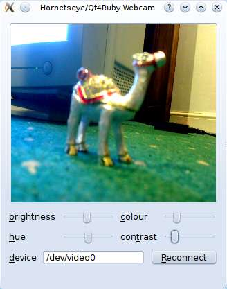

This is an example using an XVideo widget to implement a webcam viewer. The viewer also has controls for a few camera features.

To use this application you need to install Qt4Ruby. You also need to compile the user interface description file first:

    rbuic4 webcam.ui > ui_webcam.rb

The UI file is available for download here: [webcam.ui](webcam.ui)

    require 'rubygems'
    require 'hornetseye_v4l2'
    require 'hornetseye_qt4'
    require 'ui_webcam'
    include Hornetseye
    app = Qt::Application.new ARGV
    class Webcam < Qt::Dialog
      slots 'open_camera()'
      slots 'set_brightness(int)'
      slots 'set_hue(int)'
      slots 'set_colour(int)'
      slots 'set_contrast(int)'
      def initialize( parent = nil )
        super parent
        @ui = Ui::WebcamWindow.new
        @ui.setupUi self
        @sliders = { @ui.brightnessSlider => V4L2Input::FEATURE_BRIGHTNESS,
                     @ui.hueSlider => V4L2Input::FEATURE_HUE,
                     @ui.colourSlider => V4L2Input::FEATURE_SATURATION,
                     @ui.contrastSlider => V4L2Input::FEATURE_CONTRAST }
        @xvwidget = XvWidget.new
        @ui.scrollArea.widget = @xvwidget
        connect @ui.reconnectButton, SIGNAL('clicked()'), self, SLOT('open_camera()')
        connect @ui.brightnessSlider, SIGNAL('valueChanged(int)'),
                self, SLOT('set_brightness(int)')
        connect @ui.hueSlider, SIGNAL('valueChanged(int)'),
                self, SLOT('set_hue(int)')
        connect @ui.colourSlider, SIGNAL('valueChanged(int)'),
                self, SLOT('set_colour(int)')
        connect @ui.contrastSlider, SIGNAL('valueChanged(int)'),
                self, SLOT('set_contrast(int)')
        @timer = 0
        open_camera
      end
      def open_camera
        @ui.errorLabel.text = ''
        begin
          if @input
            @input.close
            @input = nil
          end
          input = V4L2Input.new @ui.deviceEdit.text do |modes|
            modes.select { |mode| mode.rgb? }.sort_by { |mode| ( mode.width - 640 ).abs }.first
          end
          input.read
          @sliders.each do |slider,feature|
            if input.feature_exist? feature
              slider.minimum = input.feature_min feature
              slider.maximum = input.feature_max feature
              slider.value = input.feature_read feature
              slider.enabled = true
            else
              slider.enabled = false
            end
          end
          @input = input
          @timer = startTimer 0 if @timer == 0
        rescue RuntimeError => e
          @ui.errorLabel.text = e.to_s
          @input = nil
        end
        @input
      end
      def set_brightness( value )
        @input.feature_write V4L2Input::FEATURE_BRIGHTNESS, value if @input
      end
      def set_hue( value )
        @input.feature_write V4L2Input::FEATURE_HUE, value if @input
      end
      def set_colour( value )
        @input.feature_write V4L2Input::FEATURE_SATURATION, value if @input
      end
      def set_contrast( value )
        @input.feature_write V4L2Input::FEATURE_CONTRAST, value if @input
      end
      def timerEvent( e )
        begin
          @xvwidget.write @input.read
        rescue RuntimeError => e
          killTimer @timer
          @timer = 0
        end
      end
    end
    win = Webcam.new
    win.show
    app.exec

2D Plot
-------

With Gordon James Miller's [rgplot](http://rgplot.rubyforge.org/) package you can use [Gnuplot](http://www.gnuplot.info/) from within Ruby. This example shows how you can plot the histogram of an image.

    require 'rubygems'
    require 'hornetseye_rmagick'
    require 'gnuplot'
    include Hornetseye
    def plot( *arrs )
      options = arrs.last.is_a?( Hash ) ? arrs.pop : {}
      { :title => [ nil ] * arrs.size }.merge options
      title = options[ :title ]
      title = [ title ] unless title.is_a? Array
      Gnuplot.open do |gp|
        Gnuplot::Plot.new( gp ) do |plot|
          arrs.zip( title ).each do |arr,t|
            x = (0...arr.size).collect { |v| v.to_f }
            plot.data << Gnuplot::DataSet.new( [ x, arr ] ) do |ds|
              ds.with = "linespoints"
              if t
                ds.title = t
              else
                ds.notitle
              end
            end
          end
        end
      end
      nil
    end
    img = MultiArray.load_ubyte 'http://www.wedesoft.demon.co.uk/hornetseye-api/images/grey.png'
    plot img.histogram( 256 ), :title => [ 'Histogram' ]

3D Plot
-------

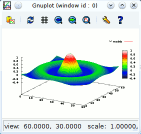

This example shows how you can use Gnuplot to make a 3D plot of a two-dimensional array.

    require 'rubygems'
    require 'multiarray'
    require 'gnuplot'
    include  Hornetseye
    class Node
      def to_gsplot
        retval = ""
        for j in 0...shape[1]
          for i in 0...shape[0]
            retval += " #{self[i,j]}"
          end
          retval += "\n"
        end
        retval += "\n"
        retval
      end
      def plot
        Gnuplot.open do |gp|
          Gnuplot::SPlot.new( gp ) do |plot|
            plot.pm3d
            plot.hidden3d
            plot.palette 'defined (   0 "black", 51 "blue", 102 "green", ' +
                                   '153 "yellow", 204 "red", 255 "white" )'
            plot.data << Gnuplot::DataSet.new( self ) do |ds|
              ds.with = 'lines'
              ds.matrix = true
            end
          end
        end
      end
    end
    s = lazy( 60 ) { |i| ( i + 0.5 - 60 / 2 ) / Math::PI }
    sinc = finalise do |i,j|
      r = Math.hypot s[i], s[j]
      Math.sin( r ) / r
    end
    sinc.plot

Depth from Focus
----------------

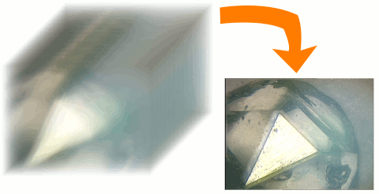

This is an implementation of depth of focus. The Sobel gradient magnitude of the focus stack is used as a sharpness measure. An image with extended depth of field is created (deep view). Furthermore a height field is generated. With POVRay the height field and the deep view can be used to generate a 3D rendering.

Note that the [trollop](http://trollop.rubyforge.org/) Ruby-extension is required for parsing the command line.

    require 'rubygems'
    require 'hornetseye_rmagick'
    require 'hornetseye_xorg'
    require 'trollop'
    include Hornetseye
    opts = Trollop::options do
      banner <<EOS
    Generate height field and deep view from focus stack.
    
    Usage:
           ./depthfromfocus.rb [options] <file names>+
    
    where [options] are:
    EOS
      opt :sigma, 'Sigma for Gaussian blur (1/pixelsize)', :default => 2.5
      opt :field, 'Output PGM file name for height field', :type => String
      opt :view, 'Output PPM file name for deep view', :type => String
      opt :alternative, 'Threat later half of filenames as alternative focus ' +
          'stack to generate deep view'
    end
    sigma = opts[ :sigma ]
    Trollop::die :sigma, 'must be greater than zero' unless sigma > 0
    field_file = opts[ :field ]
    Trollop::die :field, 'is required' unless field_file
    view_file = opts[ :view ]
    Trollop::die :view, 'is required' unless view_file
    alternative = opts[ :alternative ]
    if alternative
      if ARGV.size % 2 != 0
        Trollop::die 'Even number of file names required when using alternative ' +
          'focus stack'
      end
      n = ARGV.size / 2
      stack_file = ARGV.slice! 0, n
      alternative_file = ARGV.slice! 0, n
    else
      stack_file = ARGV
      alternative_file = nil
    end
    Trollop::die 'Cannot handle more than 255 files' if stack_file.size > 255
    display = X11Display.new
    field_output = XImageOutput.new
    view_output = XImageOutput.new
    field_window = X11Window.new display, field_output, 320, 240
    view_window = X11Window.new display, view_output, 320, 240
    field, view, max_sharpness = nil, nil, nil
    stack_file.each_with_index do |f_name,i|
      img = MultiArray.load_ubytergb f_name
      if field
        if img.shape != field.shape
          raise "Image '#{f_name}' must be of size #{field.shape[0]}x" +
            "#{field.shape[1]} (but was #{img.shape[0]}x#{img.shape[1]})"
        end
      else
        field = MultiArray.ubyte( *img.shape ).fill!
        view = MultiArray.ubytergb( *img.shape ).fill!
        max_sharpness = MultiArray.dfloat( *img.shape ).fill!
        field_window.resize *img.shape
        view_window.resize *img.shape
        field_window.show
        view_window.show
      end
      sharpness = ( img.sobel( 0 ) ** 2 +
                    img.sobel( 1 ) ** 2 ).to_dfloat.gauss_blur sigma
      mask = sharpness > max_sharpness
      field = mask.conditional i, field
      if alternative
        alternative_img = MultiArray.load_ubytergb alternative_file[ i ]
        view = mask.conditional alternative_img, view
      else
        view = mask.conditional img, view
      end
      max_sharpness = mask.conditional sharpness, max_sharpness
      progress = "#{ "%3d" % i }/#{ "%3d" % stack_file.size }"
      field_window.title = "Height field (#{progress})"
      view_window.title = "Deep view (#{progress})"
      field_output.write field * ( 255.0 / stack_file.size )
      view_output.write view
      display.process_events
    end
    field.save_ubyte field_file
    view.save_ubytergb view_file
    field_window.title = 'Height field'
    view_window.title = 'Deep view'
    display.event_loop

Line Fit
--------

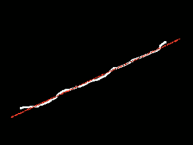

This program fits a line assuming that the input image is showing a single white line without outliers. The problem of ambiguity with the orientation of the line is overcome by estimating "2*a" instead of the angle "a".

    require 'rubygems'
    require 'hornetseye_rmagick'
    require 'hornetseye_xorg'
    include Hornetseye
    class MultiArray
      class << self
        def cramp( w, h )
          lazy( w, h ) { |i,j| i + Complex::I * j }
        end
      end
    end
    img = MultiArray.load_ubyte 'http://www.wedesoft.demon.co.uk/hornetseye-api/images/line.png'
    x = MultiArray.cramp( *img.shape ).mask img >= 128
    c = x.sum / x.size.to_f
    a = Math.sqrt( ( ( x - c ) ** 2 ).sum / x.size )
    gc = Magick::Draw.new
    gc.stroke 'red'
    gc.stroke_width 1
    gc.line( ( c - 2 * a ).real, ( c - 2 * a ).imag,
             ( c + 2 * a ).real, ( c + 2 * a ).imag )
    result = img.to_ubytergb.to_magick
    gc.draw result
    result.to_ubytergb.show

Hough Transform
---------------

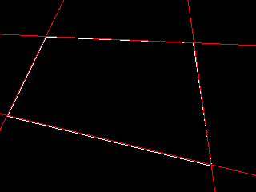

The following example detects white lines in a black-and-white image using a Hough transform.

    require 'rubygems'
    require 'multiarray'
    require 'hornetseye_rmagick'
    require 'hornetseye_xorg'
    include Hornetseye
    class Node
      def nms( threshold = 0 )
        finalise { dilate.major( threshold ) <= self }
      end
    end
    A_RANGE = 0 .. 179
    THRESHOLD = 128
    img = MultiArray.load_ubyte 'http://www.wedesoft.demon.co.uk/hornetseye-api/images/lines.png'
    diag = Math.sqrt( img.width ** 2 + img.height ** 2 )
    d_range = -( diag + 1 ).div( 2 ) ... ( diag + 1 ).div( 2 )
    binary = img >= THRESHOLD
    x = lazy( *img.shape ) { |i,j| i - img.width  / 2 }.mask binary
    y = lazy( *img.shape ) { |i,j| j - img.height / 2 }.mask binary
    idx = lazy( A_RANGE.end + 1 ) { |i| i }
    angle = lazy { Math::PI * idx / A_RANGE.end }
    dist = lazy( d_range.end + 1 - d_range.begin ) { |i| i + d_range.begin }
    cos, sin = lazy { |i| Math.cos( angle[ i ] ) }, lazy { |i| Math.sin( angle[ i ] ) }
    a = lazy( angle.size, x.size ) { |i,j| i }
    d = lazy { |i,j| ( x[j] * cos[i] + y[j] * sin[i] - d_range.begin ).to_int }
    histogram = [ a, d ].histogram A_RANGE.end + 1, d_range.end + 1 - d_range.begin
    peaks = histogram.nms 40
    peaks.conditional( RGB( 255, 0, 0 ), histogram.normalise ).show
    a = lazy( d_range.end + 1 - d_range.begin ) { |j| angle }.mask peaks
    d = lazy( A_RANGE.end + 1 ) { |i| dist }.roll.mask peaks
    x = lazy { |i,j| ( Math.cos( a[j] ) * d[j] - Math.sin( a[j] ) * dist[i] + img.width  / 2 ).to_int }
    y = lazy { |i,j| ( Math.sin( a[j] ) * d[j] + Math.cos( a[j] ) * dist[i] + img.height / 2 ).to_int }
    m = lazy { ( x >= 0 ).and( x < img.shape[0] ).and( y >= 0 ).and( y < img.shape[1] ) }
    ( [ x.mask( m ), y.mask( m ) ].histogram( *img.shape ) > 0 ).
      conditional( RGB( 255, 0, 0 ), img ).show

PCA Recognition
---------------

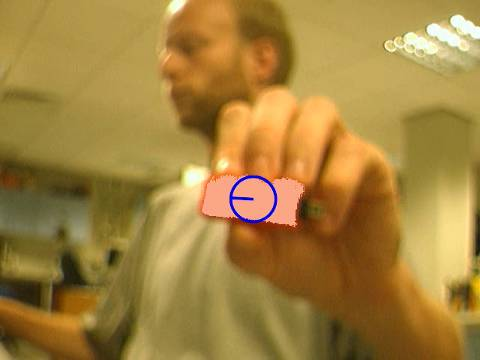

The example program performs two-dimensional object recognition with three degrees of freedom. This is a customised algorithm which only works on images showing a single object which can be detected using colour-segmentation. In a controlled environment however this algorithm can be very useful as it is easy to implement. This algorithm has become popular recently in the context of touchless interfaces.

    require 'rubygems'
    require 'matrix'
    require 'hornetseye_rmagick'
    require 'hornetseye_v4l2'
    require 'hornetseye_qt4'
    include Hornetseye
    class Node
      def rgbabs
        r.abs + g.abs + b.abs
      end
    end
    class PCAWindow < Qt::Widget
      SIZE2 = 20
      def initialize
        super
        self.windowTitle = "PCA Recognition"
        @xvideo = Hornetseye::XvWidget.new self
        @slider = Qt::Slider.new Qt::Horizontal
        @checkbox = Qt::CheckBox.new '&Freeze Reference', self
        @slider.minimum = 0
        @slider.value = 32
        @slider.maximum = 128
        layout = Qt::VBoxLayout.new self
        layout.addWidget @xvideo
        hlayout = Qt::HBoxLayout.new
        hlayout.addWidget @slider
        hlayout.addWidget @checkbox
        layout.addLayout hlayout
        @input = V4L2Input.new
        @w, @h = @input.width, @input.height
        resize @w, @h
        @reference = RGB 128, 128, 128
        @x, @y = lazy( @w, @h ) { |i,j| i }, lazy( @w, @h ) { |i,j| j }
        @xx, @yy, @xy = @x ** 2, @y ** 2, @x * @y
        @old_eigenvector = Vector[ 1, 0 ]
        startTimer 0
      end
      def timerEvent( e )
        img = @input.read_ubytergb
        if not @checkbox.checked?
          box = [ ( @w / 2 - SIZE2 )...( @w / 2 + SIZE2 ),
                  ( @h / 2 - SIZE2 )...( @h / 2 + SIZE2 ) ]
          area = img[ *box ]
          @reference = area.sum / area.size
        else
        end
        mask = ( img.to_sintrgb - @reference ).rgbabs < @slider.value
        img = mask.conditional @reference / 2 + RGB( 128, 128, 128 ), img
        if not @checkbox.checked?
          img[ *box ] = 255 - area
        else
          n = mask.to_ubyte.sum
          if n > 0
            sum = Vector[ @x.mask( mask ).sum, @y.mask( mask ).sum ]
            center = sum * ( 1.0 / n )
            xx = @xx.mask( mask ).sum
            yy = @yy.mask( mask ).sum
            xy = @xy.mask( mask ).sum
            squares = Matrix[ [ xx, xy ], [ xy, yy ] ]
            covariance = ( n * squares - sum.covector.transpose * sum.covector ) /
              ( n ** 2 ).to_f
            discriminant = ( covariance.trace ** 2 - 4 * covariance.determinant )
            discriminant = 0.0 if discriminant < 0.0
            # Take smallest eigenvalue. Eigenvalues are
            # "0.5 * ( covariance.trace +- Math.sqrt( discriminant ) )"
            lambda1 = 0.5 * ( covariance.trace - Math.sqrt( discriminant ) )
            eigenspace = covariance - lambda1 * Matrix.unit( 2 )
            # Compute eigenvector by projecting basis-vectors.
            vector1 = eigenspace * Vector[ 1, 0 ] - Vector[ 1, 0 ]
            vector2 = eigenspace * Vector[ 0, 1 ] - Vector[ 0, 1 ]
            if vector1.r >= vector2.r
              eigenvector = vector1 * ( 1.0 / vector1.r )
            else
              eigenvector = vector2 * ( 1.0 / vector2.r )
            end
            # Resolve ambiguity by comparing with previous eigenvector.
            if @old_eigenvector.inner_product( eigenvector ) < 0
              eigenvector = eigenvector.collect { |x| -x }
            end
            @old_eigenvector = eigenvector
            gc = Magick::Draw.new
            pointer = center + eigenvector * 30
            gc.fill_opacity( 0 ).stroke( 'blue' ).stroke_width( 3 )
            gc.circle( center[0], center[1], pointer[0], pointer[1] )
            gc.line( center[0], center[1], pointer[0], pointer[1] )
            img = img.to_ubytergb.to_magick
            gc.draw img
            img = img.to_ubytergb
          end
        end
        @xvideo.write img
      end
      def keyPressEvent( event )
        case event.key
        when Qt::Key_Escape
          close
        else
          super event
        end
      end
    end
    app = Qt::Application.new ARGV
    PCAWindow.new.show
    app.exec

Phase Correlation
-----------------

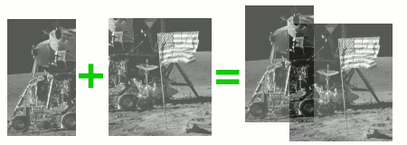

This is an implementation of the phase correlation for aligning images. This implementation also works on images which are of different size. I.e. stitching of overlapping images is possible as well as searching a small template in a large image. Note that you may have to add a windowing function to the implementation to avoid boundary effects.

    require 'rubygems'
    require 'hornetseye_fftw3'
    require 'hornetseye_rmagick'
    require 'hornetseye_xorg'
    include Hornetseye
    class Node
      def zeropad( *s )
        retval = MultiArray.new( typecode, *s ).fill!
        retval[ 0 ... shape[0], 0 ... shape[1] ] = self
        retval
      end
      def phase_corr_cyclical( other )
        nominator = rfft * other.rfft.conj
        denominator = nominator.abs
        mask = denominator.abs > 1.0e-5
        ( nominator.mask( mask ) / denominator.mask( mask ) ).unmask( mask ).irfft
      end
      def phase_corr( other )
        ext_shape = [ shape[0] + other.shape[0], shape[1] + other.shape[1] ]
        zeropad( *ext_shape ).phase_corr_cyclical other.zeropad( *ext_shape )
      end
    end
    syntax = <<END_OF_STRING
    Align images using phase correlation
    Syntax : pc.rb <image1> <image2>
    Example: pc.rb image1.jpg image2.jpg
    END_OF_STRING
    if ARGV.size != 2
      puts syntax
      raise "Wrong number of command-line arguments"
    end
    image = MultiArray.load_ubyte ARGV[0]
    template = MultiArray.load_ubyte ARGV[1]
    shift = image.phase_corr template
    shiftx = lazy( *shift.shape ) { |i,j| i }.mask( shift >= shift.max )[0]
    shifty = lazy( *shift.shape ) { |i,j| j }.mask( shift >= shift.max )[0]
    shiftx = shiftx - image.shape[0] - template.shape[0] if shiftx > image.shape[0]
    shifty = shifty - image.shape[1] - template.shape[1] if shifty > image.shape[1]
    minx = [ 0, shiftx ].min
    miny = [ 0, shifty ].min
    maxx = [ image.shape[0], template.shape[0] + shiftx ].max - 1
    maxy = [ image.shape[1], template.shape[1] + shifty ].max - 1
    offsetx = -minx
    offsety = -miny
    resultwidth  = maxx + 1 - minx
    resultheight = maxy + 1 - miny
    result1 = MultiArray.ubyte( resultwidth, resultheight ).fill!
    result1[ offsetx ... offsetx + image.shape[0],
             offsety ... offsety + image.shape[1] ] = image / 2
    result2 = MultiArray.ubyte( resultwidth, resultheight ).fill!
    result2[ shiftx + offsetx ... shiftx + offsetx + template.shape[0],
             shifty + offsety ... shifty + offsety + template.shape[1] ] = template / 2
    ( result1 + result2 ).show

Normalised Cross-Correlation
----------------------------

Camshift Tracking
-----------------

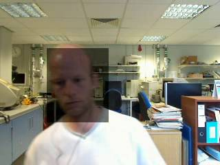

This is an implementation of the Camshift algorithm for real-time tracking. The algorithm tracks the object by maximising the similarity of a hue reference histogram and a hue scene histogram.

    require 'rubygems'
    require 'hornetseye_v4l2'
    require 'hornetseye_xorg'
    include Hornetseye
    WIDTH = 320
    BOX_SIZE = 64
    SHIFT = 3
    N = 0x100 >> SHIFT
    RANGE = 0x30 .. 0xD0
    MAX_ITER = 5
    RATIO = 1.2
    HUE = finalise N, N, N do |x,y,z|
      r, g, b = ( x + 0.5 ) / N, ( y + 0.5 ) / N, ( z + 0.5 ) / N
      min = r.minor( g ).minor b
      max = r.major( g ).major b
      max.eq( min ).
        conditional( 0,
          max.eq( r ).and( g >= b ).
          conditional( 60 * ( g - b ) / ( max - min ),
             max.eq( r ).and( g < b ).
             conditional( 60 * ( g - b ) / ( max - min ) + 360,
               max.eq( g ).
               conditional( 60 * ( b - r ) / ( max - min ) + 120,
                            60 * ( r - g ) / ( max - min ) + 240 ) ) ) )
    end
    SAT = finalise N, N, N do |x,y,z|
      r, g, b = ( x + 0.5 ) / N, ( y + 0.5 ) / N, ( z + 0.5 ) / N
      min = r.minor( g ).minor b
      max = r.major( g ).major b
      max.eq( 0 ).conditional 0, 255 * ( max - min ) / max
    end
    MIN = finalise N, N, N do |x,y,z|
      r, g, b = ( x + 0.5 ) / N, ( y + 0.5 ) / N, ( z + 0.5 ) / N
      r.minor( g ).minor b
    end
    MAX = finalise N, N, N do |x,y,z|
      r, g, b = ( x + 0.5 ) / N, ( y + 0.5 ) / N, ( z + 0.5 ) / N
      r.major( g ).major b
    end
    input = V4L2Input.new do |modes|
      modes.select { |mode| mode.rgb? }.sort_by { |mode| ( mode.width - WIDTH ).abs }.first
    end
    box = [ ( input.width  - BOX_SIZE ) / 2 ... ( input.width  + BOX_SIZE ) / 2,
            ( input.height - BOX_SIZE ) / 2 ... ( input.height + BOX_SIZE ) / 2 ]
    reference = nil
    X11Display.show :title => 'Capture Reference Histogram' do
      img = input.read_ubytergb.flip 0
      reference = img[ *box ].dup
      img[ *box ] = 0x80 + ( reference >> 1 )
      img
    end
    histogram = ( reference >> SHIFT ).lut( HUE.to_usint ).histogram 360
    flesh_map = ( MIN >= RANGE.begin / 256.0 ).and( MAX <= RANGE.end / 256.0 ).
      conditional( HUE.to_usint.lut( histogram ), 0 )
    cx, cy = input.width / 2, input.height / 2
    w, h = BOX_SIZE, ( BOX_SIZE * RATIO ).to_i
    X11Display.show :title => 'Camshift' do
      image = input.read_ubytergb.flip 0
      n = 0
      sum = 0
      begin
        region = image[ cx - w / 2 ... cx - w / 2 + w, cy - h / 2 ... cy - h / 2 + h ]
        weight = ( region >> SHIFT ).lut flesh_map
        old_sum = sum
        sum = weight.sum
        if sum > 0
          dx = sum { |i,j| weight[ i, j ] * i } / sum
          dy = sum { |i,j| weight[ i, j ] * j } / sum
          cx = cx + dx - w / 2
          cy = cy + dy - h / 2
          s = 2 * Math.sqrt( sum / flesh_map.max.to_f / RATIO )
          w, h = s.to_i, ( s * RATIO ).to_i
          w = [ [ w, 3 ].max, input.width ].min
          h = [ [ h, 3 ].max, input.height ].min
          cx = [ [ cx, w / 2 ].max, input.width  - w + w / 2 ].min.to_i
          cy = [ [ cy, h / 2 ].max, input.height - h + h / 2 ].min.to_i
        end
        n += 1
      end while old_sum < sum and n < MAX_ITER 
      image[ cx - w / 2 ... cx - w / 2 + w, cy - h / 2 ... cy - h / 2 + h ] /= 2
      image
    end

Lucas-Kanade Tracker
--------------------

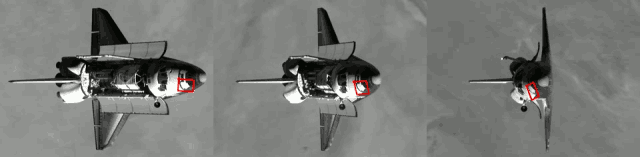

This is an implementation of the (inverse compositional) Lucas-Kanade algorithm. The Lucas-Kanade algorithm iteratively tries to minimise the difference between the template and a warped image. The technique can be used for image alignment, tracking, optic flow analysis, and motion estimation. Possible improvements are to incorporate illumination changes and a proper threatment of the image boundaries.

The example offers five different models

1. shift
2. shift and scale
3. shift and rotation
4. affine transform
5. 2-d homography

A video for testing can be created using PovRay and the files [polygon.ini](polygon.ini) and [polygon.pov](polygon.pov).

    require 'rubygems'
    require 'matrix'
    require 'hornetseye_ffmpeg'
    require 'hornetseye_rmagick'
    require 'hornetseye_xorg'
    # require 'matrix_fix'
    include Hornetseye
    syntax = <<END_OF_STRING
    Align images using phase correlation
    Syntax: lktracker.rb <video> <backgr.> <model> <width> <height> <p1> <p2> ...
    Examples:
      ./lktracker.rb polygon.avi shift 94 65 80 35
      ./lktracker.rb polygon.avi shift-n-scale 94 65 80 35 1 1
      ./lktracker.rb polygon.avi isometry 94 65 80 35 0
      ./lktracker.rb polygon.avi rotate-n-scale 94 65 80 35 0 1
      ./lktracker.rb polygon.avi affine 94 65 80 35 1 0 0 1
      ./lktracker.rb polygon.avi homography 94 65 1 0 0 1 80 35 0 0
    END_OF_STRING
    if ARGV.size < 2
      puts syntax
      raise 'Wrong number of command-line arguments'
    end
    class Node
      def warp_clipped_interpolate( x, y )
        x0 = x.floor.to_int
        y0 = y.floor.to_int
        x1 = x0 + 1
        y1 = y0 + 1
        fx1 = x - x0
        fy1 = y - y0
        fx0 = x1 - x
        fy0 = y1 - y
        return warp( x0, y0 ) * fx0 * fy0 +
               warp( x1, y0 ) * fx1 * fy0 +
               warp( x0, y1 ) * fx0 * fy1 +
               warp( x1, y1 ) * fx1 * fy1
      end
    end
    input = AVInput.new ARGV[0]
    w, h = ARGV[2].to_i, ARGV[3].to_i
    case ARGV[1]
    when 'shift'
      raise 'Shifting model requires 2 parameters' if ARGV.size != 6
      p = Vector[ *ARGV[4...6].collect { |a| a.to_f } ]
      def model( p, x, y )
        Vector[ x + p[0], y + p[1] ]
      end
      def derivative( x, y ) # derivative at p = [ 0, 0 ]
        Matrix[ [ 1, 0 ], [ 0, 1 ] ]
      end
      def compose( p, d )
        p + d
      end
    when 'shift-n-scale'
      raise 'Shift-and-scale model requires 4 parameters' if ARGV.size != 8
      p = Vector[ *ARGV[4...8].collect { |a| a.to_f } ]
      def model( p, x, y )
        Vector[ x * p[2] + p[0], y * p[3] + p[1] ]
      end
      def derivative( x, y ) # derivative at p = [ 0, 0, 1, 1 ]
        Matrix[ [ 1, 0 ], [ 0, 1 ], [ x, 0 ], [ 0, y ] ]
      end
      def compose( p, d )
        p + Vector[ p[2] * d[0], p[3] * d[1], p[2] * d[2], p[3] * d[3] ]
      end
    when 'isometry'
      raise 'Isometric model requires 3 parameters' if ARGV.size != 7
      p = Vector[ *ARGV[4...7].collect { |a| a.to_f } ]
      def model( p, x, y )
        cw, sw = Math::cos( p[2] ), Math::sin( p[2] )
        Vector[ x * cw - y * sw + p[0], x * sw + y * cw + p[1] ]
      end
      def derivative( x, y ) # derivative at p = [ 0, 0, 0 ]
        Matrix[ [ 1, 0 ], [ 0, 1 ], [ -y, x ] ]
      end
      def compose( p, d )
        cw, sw = Math::cos( p[2] ), Math::sin( p[2] )
        p + Matrix[ [  cw, -sw, 0 ],
                    [  sw,  cw, 0 ],
                    [   0,   0, 1 ] ] * d
      end
    when 'rotate-n-scale'
      raise 'Isometric model requires 3 parameters' if ARGV.size != 8
      p = Vector[ *ARGV[4...8].collect { |a| a.to_f } ]
      def model( p, x, y )
        cw, sw, s = Math::cos( p[2] ), Math::sin( p[2] ), p[3]
        Vector[ x * cw * s - y * sw * s + p[0], x * sw * s + y * cw * s + p[1] ]
      end
      def derivative( x, y ) # derivative at p = [ 0, 0, 0 ]
        Matrix[ [ 1, 0 ], [ 0, 1 ], [ -y, x ], [ x, y ] ]
      end
      def compose( p, d )
        cw, sw, s = Math::cos( p[2] ), Math::sin( p[2] ), p[3]
        p + Matrix[ [  cw, -sw, 0, 0 ],
                    [  sw,  cw, 0, 0 ],
                    [   0,   0, 1, 0 ],
                    [   0,   0, 0, 1 ] ] * d
      end
    when 'affine'
      raise 'Affine model requires 6 parameters' if ARGV.size != 10
      p = Vector[ *ARGV[4...10].collect { |a| a.to_f } ]
      def model( p, x, y )
        Vector[ x * p[2] + y * p[4] + p[0], x * p[3] + y * p[5] + p[1] ]
      end
      def derivative( x, y ) # derivative at p = [ 0, 0, 1, 0, 0, 1 ]
        Matrix[ [ 1, 0 ], [ 0, 1 ], [ x, 0 ], [ 0, x ], [ y, 0 ], [ 0, y ] ]
      end
      def compose( p, d )
        p + Matrix[ [ p[2], p[4],    0,    0,    0,    0 ],
                    [ p[3], p[5],    0,    0,    0,    0 ],
                    [    0,    0, p[2], p[4],    0,    0 ],
                    [    0,    0, p[3], p[5],    0,    0 ],
                    [    0,    0,    0,    0, p[2], p[4] ],
                    [    0,    0,    0,    0, p[3], p[5] ] ] * d
      end
    when 'homography'
      raise 'Homography requires 8 parameters' if ARGV.size != 12
      p = Vector[ *ARGV[4...12].collect { |a| a.to_f } ]
      def model( p, x, y )
        h = Matrix[ [ p[0], p[2], p[4] ],
                    [ p[1], p[3], p[5] ],
                    [ p[6], p[7],    1 ] ]
        rh = h * Vector[ x, y, 1 ]
        Vector[ rh[0] / rh[2], rh[1] / rh[2] ]
      end
      def derivative( x, y )
        Matrix[
          [ x, 0 ], [ 0, x ], [ y, 0 ], [ 0, y ], [ 1, 0 ], [ 0, 1 ],
          [ -x * x, -x * y ], [ -y * x, -y * y ] ]
      end
      def compose( p, d )
        h = Matrix[ [ p[0], p[2], p[4] ],
                    [ p[1], p[3], p[5] ],
                    [ p[6], p[7],    1 ] ]
        hd = Matrix[ [ 1 + d[0],     d[2], d[4] ],
                     [     d[1], 1 + d[3], d[5] ],
                     [     d[6],     d[7],    1 ] ]
        hr = h * hd
        hr = hr / hr[2,2]
        Vector[ hr[0,0], hr[1,0], hr[0,1], hr[1,1],
          hr[0,2], hr[1,2], hr[2,0], hr[2,1] ]
      end
    else
      raise "No such model (#{ARGV[1]})"
    end
    img = input.read_ubyte
    sigma = 2.5
    # compute gradient on a larger field and crop later to avoid fringe effects.
    b = ( Array.gauss_gradient_filter( sigma ).size - 1 ) / 2
    x = lazy( w + 2 * b, h + 2 * b ) { |i,j| i - b }
    y = lazy( w + 2 * b, h + 2 * b ) { |i,j| j - b }
    tpl = img.warp_clipped_interpolate *model( p, x, y )
    gx = tpl.gauss_gradient( sigma, 0 )
    gy = tpl.gauss_gradient( sigma, 1 )
    tpl, gx, gy, x, y = *( [ tpl, gx, gy, x, y ].collect { |arr| arr[ b...(w+b), b...(h+b) ] } )
    c = derivative( x, y ) * Vector[ gx, gy ]
    hs = ( c * c.covector ).collect { |e| e.sum }
    hsinv = hs.inverse
    display = X11Display.new
    output = XImageOutput.new
    window = X11Window.new display, output, *img.shape
    window.title = 'Lucas-Kanade tracker'
    window.show
    while input.status? and output.status?
      img = input.read_ubyte
      for i in 0...5
        diff = img.warp_clipped_interpolate( *model( p, x, y ) ) - tpl
        s = c.collect { |e| ( e * diff ).sum }
        p = compose( p, hsinv * s )
      end
      gc = Magick::Draw.new
      gc.fill_opacity 0
      gc.stroke( 'red' ).stroke_width 1
      gc.line *( model( p, 0, 0 ).to_a + model( p, w, 0 ).to_a )
      gc.line *( model( p, 0, h ).to_a + model( p, w, h ).to_a )
      gc.line *( model( p, 0, 0 ).to_a + model( p, 0, h ).to_a )
      gc.line *( model( p, w, 0 ).to_a + model( p, w, h ).to_a )
      gc.circle *( model( p, 0, 0 ).to_a + model( p, 3, 0 ).to_a )
      result = img.to_ubytergb.to_magick
      gc.draw result
      output.write result.to_ubytergb
      display.process_events
    end

EAN-13 Barcode Reader
---------------------

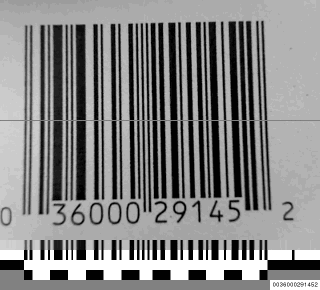

The example below is a barcode reader for reading EAN-13 (and UPC) barcodes. Reading of the barcode is restricted to a single line of the camera image.  However the application can read barcodes forwards as well as backwards. The detected numbers are displayed using RMagick.

    require 'rubygems'
    require 'hornetseye_v4l2'
    require 'hornetseye_xorg'
    require 'hornetseye_rmagick'
    include Hornetseye
    class Integer
      def checksum
        x = self / 10
        retval = 0
        while x > 0
          retval += ( x % 10 ) * 3
          x /= 10
          retval += x
          x /= 10
        end
        retval = retval % 10
        retval = 10 - retval unless retval == 0
        retval
      end
      def check?
        checksum == self % 10
      end
    end
    input = V4L2Input.new { |modes| modes.sort_by { |mode| ( mode.width - 640 ).abs }.first }
    SIGMA = 20.0
    NOISE = 10.0
    ERR_THRESH = 0.25
    WIDTH, HEIGHT = input.width, input.height
    result = MultiArray.ubytergb WIDTH, HEIGHT + 100
    result[ HEIGHT ... HEIGHT + 100 ] = 128
    segment = Sequence[ *( [ 0 ] * 3 +
                           ( 1 .. 6 ).collect { |i| [ i ] * 4 }.flatten +
                           [ 7 ] * 5 +
                           ( 8 .. 13 ).collect { |i| [ i ] * 4 }.flatten +
                           [ 14 ] * 3 ) ]
    digits = MultiArray[ [ [ 0, 0, 0, 1, 1, 0, 1 ],
                           [ 0, 0, 1, 1, 0, 0, 1 ],
                           [ 0, 0, 1, 0, 0, 1, 1 ],
                           [ 0, 1, 1, 1, 1, 0, 1 ],
                           [ 0, 1, 0, 0, 0, 1, 1 ],
                           [ 0, 1, 1, 0, 0, 0, 1 ],
                           [ 0, 1, 0, 1, 1, 1, 1 ],
                           [ 0, 1, 1, 1, 0, 1, 1 ],
                           [ 0, 1, 1, 0, 1, 1, 1 ],
                           [ 0, 0, 0, 1, 0, 1, 1 ] ],
                         [ [ 0, 1, 0, 0, 1, 1, 1 ],
                           [ 0, 1, 1, 0, 0, 1, 1 ],
                           [ 0, 0, 1, 1, 0, 1, 1 ],
                           [ 0, 1, 0, 0, 0, 0, 1 ],
                           [ 0, 0, 1, 1, 1, 0, 1 ],
                           [ 0, 1, 1, 1, 0, 0, 1 ],
                           [ 0, 0, 0, 0, 1, 0, 1 ],
                           [ 0, 0, 1, 0, 0, 0, 1 ],
                           [ 0, 0, 0, 1, 0, 0, 1 ],
                           [ 0, 0, 1, 0, 1, 1, 1 ] ],
                         [ [ 1, 1, 1, 0, 0, 1, 0 ],
                           [ 1, 1, 0, 0, 1, 1, 0 ],
                           [ 1, 1, 0, 1, 1, 0, 0 ],
                           [ 1, 0, 0, 0, 0, 1, 0 ],
                           [ 1, 0, 1, 1, 1, 0, 0 ],
                           [ 1, 0, 0, 1, 1, 1, 0 ],
                           [ 1, 0, 1, 0, 0, 0, 0 ],
                           [ 1, 0, 0, 0, 1, 0, 0 ],
                           [ 1, 0, 0, 1, 0, 0, 0 ],
                           [ 1, 1, 1, 0, 1, 0, 0 ] ] ].to_byte
    patterns = MultiArray[ [ 0, 0, 0, 0, 0, 0, 2, 2, 2, 2, 2, 2 ],
                           [ 0, 0, 1, 0, 1, 1, 2, 2, 2, 2, 2, 2 ],
                           [ 0, 0, 1, 1, 0, 1, 2, 2, 2, 2, 2, 2 ],
                           [ 0, 0, 1, 1, 1, 0, 2, 2, 2, 2, 2, 2 ],
                           [ 0, 1, 0, 0, 1, 1, 2, 2, 2, 2, 2, 2 ],
                           [ 0, 1, 1, 0, 0, 1, 2, 2, 2, 2, 2, 2 ],
                           [ 0, 1, 1, 1, 0, 0, 2, 2, 2, 2, 2, 2 ],
                           [ 0, 1, 0, 1, 0, 1, 2, 2, 2, 2, 2, 2 ],
                           [ 0, 1, 0, 1, 1, 0, 2, 2, 2, 2, 2, 2 ],
                           [ 0, 1, 1, 0, 1, 0, 2, 2, 2, 2, 2, 2 ] ].to_byte
    X11Display.show do
      img = input.read_ubyte
      avg = img[ HEIGHT / 2 ]
      mean = avg.gauss_blur SIGMA
      var = Math.sqrt( ( ( avg - mean ) ** 2 ).gauss_blur( SIGMA ) )
      binary = ( avg < mean ).and( var >= NOISE )
      up = binary.to_ubyte.convolve( Sequence[ 1, -1 ] ).major 0
      down = binary.to_ubyte.convolve( Sequence[ -1, 1 ] ).major 0
      stripe = ( up + down ).integral
      n = up.sum
      views = Sequence.int( avg.size ).fill! 128
      zebra = Sequence.ubyte( avg.size ).fill! 128
      for o in 0 .. n - 30
        msk = ( stripe >= 2 * o + 1 ).and stripe <= 2 * o + 59
        range = lazy( WIDTH ) { |i| i }.mask( msk ).range
        views += msk.to_ubyte
        code = ( stripe[ range ] - 2 * o - 1 ).lut segment
        sequence = binary[ range ]
        s = sequence.mask( code.eq( 0 ) ).to_byte
        m = sequence.mask( code.eq( 7 ) ).to_byte
        e = sequence.mask( code.eq( 14 ) ).to_byte
        c = Sequence[ 0, *( [ 1 ] * 6 + [ 0 ] + [ 1 ] * 6 + [0] ) ].to_bool
        skew = code.histogram( 15 ).mask( c ).range
        if skew.max < skew.min * 1.3
          s_ = Sequence[ 1, 0, 1 ].warp lazy( s.size ) { |i| i * 3 / s.size }
          m_ = Sequence[ 0, 1, 0, 1, 0 ].warp lazy( m.size ) { |i| i * 5 / m.size }
          e_ = Sequence[ 1, 0, 1 ].warp lazy( e.size ) { |i| i * 3 / e.size }
          if ( s - s_ ).abs.sum < s.size * ERR_THRESH and
             ( m - m_ ).abs.sum < m.size * ERR_THRESH and
             ( e - e_ ).abs.sum < m.size * ERR_THRESH
            zebra = ( ( code % 2 ) * 255 ).unmask msk, :default => 128
            number = Hash.new 0
            max_err = Hash.new 0.0
            exp = { :forward => 11, :backward => 0 }
            ( ( 1 .. 6 ).to_a + ( 8 .. 13 ).to_a ).each do |k|
              cut = sequence.mask code.eq( k )
              d = { :forward => cut, :backward => cut.flip( 0 ) }
              span = lazy( cut.size ) { |i| i * 7 / cut.size }
              d_ = digits.roll.warp( span ).unroll
              [ :forward, :backward ].each do |dir|
                err = ( 0 ... 3 ).collect do |lgr|
                  sum { |i| lazy { |j| ( d[ dir ].to_byte[ i ] - d_[ lgr ][ j ][ i ] ).abs } }
                end
                for i in 0 .. 9
                  lgr = patterns[ i ][ 11 - exp[ dir ] ]
                  match = lazy( err[ lgr ].size ) { |i| i }.mask( err[ lgr ] <= err[ lgr ].min )[0]
                  max_err[ [ dir, i ] ] = [ max_err[ [ dir, i ] ], err[ lgr ][ match ].to_f / cut.size ].max
                  number[ [ dir, i ] ] += match * 10 ** exp[ dir ]
                end
              end
              exp[ :forward ] -= 1
              exp[ :backward ] += 1
            end
            opt = max_err.min { |x,y| x[1] <=> y[1] }.first
            number, max_err = number[ opt ] + opt[1] * 10 ** 12, max_err[ opt ]
            if max_err < ERR_THRESH and number.check?
              text = Magick::Image.new 100, 20
              draw = Magick::Draw.new
              draw.gravity Magick::CenterGravity
              draw.text 0, 0, "%013d" % number
              draw.draw text
              result[ 0 ... WIDTH - text.columns, HEIGHT + 80 ... HEIGHT + 100 ] =
                result[ text.columns ... WIDTH, HEIGHT + 80 ... HEIGHT + 100 ]
              result[ WIDTH - text.columns ... WIDTH, HEIGHT + 80 ... HEIGHT + 100 ] =
                text.to_ubytergb
              break
            end
          end
        end
      end
      result[ 0 ... WIDTH, 0 ... HEIGHT ] = img
      result[ HEIGHT / 2 ] = ~img[ HEIGHT / 2 ]
      result[ 0 ... WIDTH, HEIGHT ... HEIGHT + 20 ].roll[] = avg
      result[ 0 ... WIDTH, HEIGHT + 20 ... HEIGHT + 40 ].roll[] = binary.not.to_ubyte * 255
      result[ 0 ... WIDTH, HEIGHT + 40 ... HEIGHT + 60 ].roll[] = views.normalise
      result[ 0 ... WIDTH, HEIGHT + 60 ... HEIGHT + 80 ].roll[] = zebra
      result
    end

See Also
--------

* {Hornetseye::XvWidget}

External Links
--------------

* [Gnuplot](http://www.gnuplot.info/)
* [Ruby Gnuplot](http://rgplot.rubyforge.org/)
* [trollop](http://trollop.rubyforge.org/)
* [Camshift publication](ftp://download.intel.com/technology/itj/q21998/pdf/camshift.pdf)
* [Camshift video](http://vision.eng.shu.ac.uk/jan/camshift.avi) ([Youtube](http://www.youtube.com/watch?v=LBXgXqtt1F8))
* [European Article Number](http://en.wikipedia.org/wiki/European_Article_Number)
* [Universal Product Code](http://en.wikipedia.org/wiki/Universal_Product_Code)
* [UPC database](http://www.upcdatabase.com/)
* [EAN-13 reader video](http://vision.eng.shu.ac.uk/jan/barcode6.avi) ([Youtube](http://www.youtube.com/watch?v=Sv28MUMM_EA))
* [PCA recognition video](http://video.google.com/videoplay?docid=8157280827402899141)
* [Camspace (play games with your webcam)](http://www.camspace.com/)
* [Hough transform](http://en.wikipedia.org/wiki/Hough_transform)
* [Lucas-Kanade 20 Years on: A Unifying Framework](http://www.ri.cmu.edu/projects/project_515.html)
* [A machine vision extension for the Ruby programming language](http://digitalcommons.shu.ac.uk/mmvl_papers/2/)
* [NASA high definition videos](http://www.nasa.gov/multimedia/hd/)

