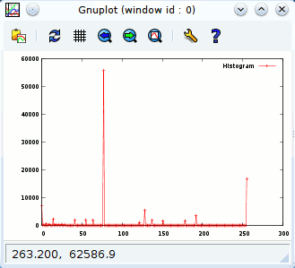

Applications
============

Video Thumbnails
----------------

EXR Viewer
----------

This is small viewer for displaying EXR images. The exposure can be modified with the slider.

The user interface was defined using Qt-Designer. The scroll area was defined by promoting a QFrame object to QScrollArea. See reference about using custom widgets for more information.

To use this application you need to install Qt4Ruby. You also need to compile the user interface description file first:

    rbuic4 exrviewer.ui > ui_exrviewer.rb

The UI file is available for download here: [exrviewer.ui](exrviewer.ui)

    require 'rubygems'
    require 'hornetseye_openexr'
    require 'hornetseye_rmagick'
    require 'hornetseye_qt4'
    require 'ui_exrviewer'
    include Hornetseye
    class EXRViewer < Qt::Widget
      slots 'load()'
      slots 'recompute()'
      def initialize( parent = nil )
        super parent
        @ui = Ui::EXRViewer.new
        @ui.setupUi self
        connect @ui.close_button, SIGNAL('clicked()'), self, SLOT('close()')
        connect @ui.load_button, SIGNAL('clicked()'), self, SLOT('load()')
        connect @ui.brightness_slider, SIGNAL('valueChanged(int)'),
                self, SLOT('recompute()')
        @arr = nil
        @channelmax = nil
        @label = Qt::Label.new
        @ui.scroll_area.setWidget @label
      end
      def load
        fileName = Qt::FileDialog.getOpenFileName self, "Load EXR File", "",
                                                  "EXR image (*.exr)"
        if fileName
          @arr = MultiArray.load_sfloatrgb fileName
          @max = proc { |x| [ x.r, x.g, x.b ].max }.call @arr.max
          @ui.brightness_slider.setEnabled true
          recompute
        end
      end
      def recompute
        factor = 2.0 ** ( @ui.brightness_slider.value / 4096.0 ) * 0xFF / @max
        image = ( @arr * factor ).minor( 0xFF ).to_ubytergb
        str = image.to_magick.to_blob do
          self.format = "PPM"
          self.depth = 8
        end
        pixmap = Qt::Pixmap.new
        pixmap.loadFromData Qt::ByteArray.fromRawData( str, str.size )
        @label.setPixmap pixmap
        @label.resize pixmap.width, pixmap.height
      end
    end
    app = Qt::Application.new ARGV
    viewer = EXRViewer.new
    viewer.show
    app.exec

XVideo Widget
-------------

The XVideo widget allows to use XVideo acceleration in a Qt4-QtRuby application. The example application shows how to write a small program for playing videos.

    require 'rubygems'
    require 'hornetseye_ffmpeg'
    require 'hornetseye_alsa'
    require 'hornetseye_qt4'
    VIDEO = ARGV[0] || 'http://ftp.halifax.rwth-aachen.de/blender/movies/sintel-1024-stereo.mp4'
    class Win < Qt::Widget
      slots 'seek(int)'
      def initialize
        super
        @screen = Hornetseye::XvWidget.new self
        @slider = Qt::Slider.new Qt::Horizontal
        layout = Qt::VBoxLayout.new self
        layout.addWidget @screen
        layout.addWidget @slider
        connect @slider, SIGNAL('valueChanged(int)'), self, SLOT('seek(int)')
        @seeking = true
        @video = nil
        @timer = 0
        start
        @slider.tracking = false
        @slider.minimum = 0
        @slider.single_step = 60
        @slider.page_step = 600
        if @video.duration
          @slider.maximum = @video.duration.to_i
        else
          @slider.maximum = ARGV[1] || 1
        end
        setWindowTitle 'XVideo'
      end
      def update_audio
        @audio_frame = @video.read_audio unless @audio_frame
        while @speaker.avail >= @audio_frame.shape[1]
          @speaker.write @audio_frame
          @audio_frame = @video.read_audio
        end
      end
      def update_video
        @screen.write @video.read_video
      end
      def timerEvent( e )
        begin
          update_audio
          update_video
          unless @slider.sliderDown
            @seeking = false
            p = @video.audio_pos.to_i
            @slider.maximum = p if p > @slider.maximum
            @slider.value = p
            @seeking = true
          end
          t = @video.audio_pos - @speaker.delay.quo( @speaker.rate )
          delay = [ 3.quo( 2 ) / @video.frame_rate, [ @video.video_pos - t, 0 ].max ].min
          killTimer @timer
          @timer = startTimer( ( delay * 1000 ).to_i )
        rescue Exception => e
          p e
          stop
        end
      end
      def start
        unless @video
          stop
          @video = Hornetseye::AVInput.new VIDEO
          @audio_frame = nil
          resize ( @video.width * @video.aspect_ratio ).to_i, @video.height
          @speaker = Hornetseye::AlsaOutput.new 'default:0', @video.sample_rate, @video.channels
          @timer = startTimer 0
        end
      end
      def stop
        @audio_frame = nil
        if @video
          @video.close
          @video = nil
        end
        if @speaker
          @speaker.close
          @speaker = nil
        end
        if @timer != 0
          killTimer @timer
          @timer = 0
          @screen.clear
        end
      end
      def seek( p )
        if @seeking
          begin
            start
            @audio_frame = nil
            @video.pos = p
            @speaker.drop
            @speaker.prepare
          rescue Exception => e
            p e
            stop
          end
        end
      end
    end
    app = Qt::Application.new ARGV
    Win.new.show
    app.exec

Webcam Viewer
-------------

This is an example using an XVideo widget to implement a webcam viewer. The viewer also has controls for a few camera features.

To use this application you need to install Qt4Ruby. You also need to compile the user interface description file first:

    rbuic4 webcam.ui > ui_webcam.rb

The UI file is available for download here: [webcam.ui](webcam.ui)

    require 'rubygems'
    require 'hornetseye_v4l2'
    require 'hornetseye_qt4'
    require 'ui_webcam'
    include Hornetseye
    app = Qt::Application.new ARGV
    class Webcam < Qt::Dialog
      slots 'open_camera()'
      slots 'set_brightness(int)'
      slots 'set_hue(int)'
      slots 'set_colour(int)'
      slots 'set_contrast(int)'
      def initialize( parent = nil )
        super parent
        @ui = Ui::WebcamWindow.new
        @ui.setupUi self
        @sliders = { @ui.brightnessSlider => V4L2Input::FEATURE_BRIGHTNESS,
                     @ui.hueSlider => V4L2Input::FEATURE_HUE,
                     @ui.colourSlider => V4L2Input::FEATURE_SATURATION,
                     @ui.contrastSlider => V4L2Input::FEATURE_CONTRAST }
        @xvwidget = XvWidget.new
        @ui.scrollArea.widget = @xvwidget
        connect @ui.reconnectButton, SIGNAL('clicked()'), self, SLOT('open_camera()')
        connect @ui.brightnessSlider, SIGNAL('valueChanged(int)'),
                self, SLOT('set_brightness(int)')
        connect @ui.hueSlider, SIGNAL('valueChanged(int)'),
                self, SLOT('set_hue(int)')
        connect @ui.colourSlider, SIGNAL('valueChanged(int)'),
                self, SLOT('set_colour(int)')
        connect @ui.contrastSlider, SIGNAL('valueChanged(int)'),
                self, SLOT('set_contrast(int)')
        @timer = 0
        open_camera
      end
      def open_camera
        @ui.errorLabel.text = ''
        begin
          if @input
            @input.close
            @input = nil
          end
          input = V4L2Input.new @ui.deviceEdit.text do |modes|
            modes.sort_by { |mode| ( mode.width - 640 ).abs }.first
          end
          input.read
          @sliders.each do |slider,feature|
            if input.feature_exist? feature
              slider.minimum = input.feature_min feature
              slider.maximum = input.feature_max feature
              slider.value = input.feature_read feature
              slider.enabled = true
            else
              slider.enabled = false
            end
          end
          @input = input
          @timer = startTimer 0 if @timer == 0
        rescue RuntimeError => e
          @ui.errorLabel.text = e.to_s
          @input = nil
        end
        @input
      end
      def set_brightness( value )
        @input.feature_write V4L2Input::FEATURE_BRIGHTNESS, value if @input
      end
      def set_hue( value )
        @input.feature_write V4L2Input::FEATURE_HUE, value if @input
      end
      def set_colour( value )
        @input.feature_write V4L2Input::FEATURE_SATURATION, value if @input
      end
      def set_contrast( value )
        @input.feature_write V4L2Input::FEATURE_CONTRAST, value if @input
      end
      def timerEvent( e )
        begin
          @xvwidget.write @input.read
        rescue RuntimeError => e
          killTimer @timer
          @timer = 0
        end
      end
    end
    win = Webcam.new
    win.show
    app.exec

2D Plot
-------

With Gordon James Miller's [rgplot](http://rgplot.rubyforge.org/) package you can use [Gnuplot](http://www.gnuplot.info/) from within Ruby. This example shows how you can plot the histogram of an image.

    require 'rubygems'
    require 'hornetseye_rmagick'
    require 'gnuplot'
    include Hornetseye
    def plot( *arrs )
      options = arrs.last.is_a?( Hash ) ? arrs.pop : {}
      { :title => [ nil ] * arrs.size }.merge options
      title = options[ :title ]
      title = [ title ] unless title.is_a? Array
      Gnuplot.open do |gp|
        Gnuplot::Plot.new( gp ) do |plot|
          arrs.zip( title ).each do |arr,t|
            x = (0...arr.size).collect { |v| v.to_f }
            plot.data << Gnuplot::DataSet.new( [ x, arr ] ) do |ds|
              ds.with = "linespoints"
              if t
                ds.title = t
              else
                ds.notitle
              end
            end
          end
        end
      end
      nil
    end
    img = MultiArray.load_ubyte 'http://www.wedesoft.demon.co.uk/hornetseye-api/images/grey.png'
    plot img.histogram( 256 ), :title => [ 'Histogram' ]

3D Plot
-------

This example shows how you can use Gnuplot to make a 3D plot of a two-dimensional array.

    require 'rubygems'
    require 'multiarray'
    require 'gnuplot'
    include  Hornetseye
    class Node
      def to_gsplot
        retval = ""
        for j in 0...shape[1]
          for i in 0...shape[0]
            retval += " #{self[i,j]}"
          end
          retval += "\n"
        end
        retval += "\n"
        retval
      end
      def plot
        Gnuplot.open do |gp|
          Gnuplot::SPlot.new( gp ) do |plot|
            plot.pm3d
            plot.hidden3d
            plot.palette 'defined (   0 "black", 51 "blue", 102 "green", ' +
                                   '153 "yellow", 204 "red", 255 "white" )'
            plot.data << Gnuplot::DataSet.new( self ) do |ds|
              ds.with = 'lines'
              ds.matrix = true
            end
          end
        end
      end
    end
    s = lazy( 60 ) { |i| ( i + 0.5 - 60 / 2 ) / Math::PI }
    sinc = finalise do |i,j|
      r = Math.hypot s[i], s[j]
      Math.sin( r ) / r
    end
    sinc.plot

Depth from Focus
----------------

This is an implementation of depth of focus. The Sobel gradient magnitude of the focus stack is used as a sharpness measure. An image with extended depth of field is created (deep view). Furthermore a height field is generated. With POVRay the height field and the deep view can be used to generate a 3D rendering.

Note that the [trollop](http://trollop.rubyforge.org/) Ruby-extension is required for parsing the command line.

    require 'rubygems'
    require 'hornetseye_rmagick'
    require 'hornetseye_xorg'
    require 'trollop'
    include Hornetseye
    opts = Trollop::options do
      banner <<EOS
    Generate height field and deep view from focus stack.
    
    Usage:
           ./depthfromfocus.rb [options] <file names>+
    
    where [options] are:
    EOS
      opt :sigma, 'Sigma for Gaussian blur (1/pixelsize)', :default => 2.5
      opt :field, 'Output PGM file name for height field', :type => String
      opt :view, 'Output PPM file name for deep view', :type => String
      opt :alternative, 'Threat later half of filenames as alternative focus ' +
          'stack to generate deep view'
    end
    sigma = opts[ :sigma ]
    Trollop::die :sigma, 'must be greater than zero' unless sigma > 0
    field_file = opts[ :field ]
    Trollop::die :field, 'is required' unless field_file
    view_file = opts[ :view ]
    Trollop::die :view, 'is required' unless view_file
    alternative = opts[ :alternative ]
    if alternative
      if ARGV.size % 2 != 0
        Trollop::die 'Even number of file names required when using alternative ' +
          'focus stack'
      end
      n = ARGV.size / 2
      stack_file = ARGV.slice! 0, n
      alternative_file = ARGV.slice! 0, n
    else
      stack_file = ARGV
      alternative_file = nil
    end
    Trollop::die 'Cannot handle more than 255 files' if stack_file.size > 255
    display = X11Display.new
    field_output = XImageOutput.new
    view_output = XImageOutput.new
    field_window = X11Window.new display, field_output, 320, 240
    view_window = X11Window.new display, view_output, 320, 240
    field, view, max_sharpness = nil, nil, nil
    stack_file.each_with_index do |f_name,i|
      img = MultiArray.load_ubytergb f_name
      if field
        if img.shape != field.shape
          raise "Image '#{f_name}' must be of size #{field.shape[0]}x" +
            "#{field.shape[1]} (but was #{img.shape[0]}x#{img.shape[1]})"
        end
      else
        field = MultiArray.ubyte( *img.shape ).fill!
        view = MultiArray.ubytergb( *img.shape ).fill!
        max_sharpness = MultiArray.dfloat( *img.shape ).fill!
        field_window.resize *img.shape
        view_window.resize *img.shape
        field_window.show
        view_window.show
      end
      sharpness = ( img.sobel( 0 ) ** 2 +
                    img.sobel( 1 ) ** 2 ).to_dfloat.gauss_blur sigma
      mask = sharpness > max_sharpness
      field = mask.conditional i, field
      if alternative
        alternative_img = MultiArray.load_ubytergb alternative_file[ i ]
        view = mask.conditional alternative_img, view
      else
        view = mask.conditional img, view
      end
      max_sharpness = mask.conditional sharpness, max_sharpness
      progress = "#{ "%3d" % i }/#{ "%3d" % stack_file.size }"
      field_window.title = "Height field (#{progress})"
      view_window.title = "Deep view (#{progress})"
      field_output.write field * ( 255.0 / stack_file.size )
      view_output.write view
      display.process_events
    end
    field.save_ubyte field_file
    view.save_ubytergb view_file
    field_window.title = 'Height field'
    view_window.title = 'Deep view'
    display.event_loop

Line Fit
--------

PCA Recognition
---------------

Phase Correlation
-----------------

Normalised Cross-Correlation
----------------------------

Mean Shift Tracking
-------------------

Camshift Tracking
-----------------

This is an implementation of the Camshift algorithm for real-time tracking. The algorithm tracks the object by maximising the similarity of a hue reference histogram and a hue scene histogram.

    require 'rubygems'
    require 'hornetseye_v4l2'
    require 'hornetseye_xorg'
    include Hornetseye
    WIDTH = 320
    BOX_SIZE = 64
    SHIFT = 3
    N = 0x100 >> SHIFT
    RANGE = 0x30 .. 0xD0
    MAX_ITER = 5
    RATIO = 1.2
    HUE = finalise N, N, N do |x,y,z|
      r, g, b = ( x + 0.5 ) / N, ( y + 0.5 ) / N, ( z + 0.5 ) / N
      min = r.minor( g ).minor b
      max = r.major( g ).major b
      max.eq( min ).
        conditional( 0,
          max.eq( r ).and( g >= b ).
          conditional( 60 * ( g - b ) / ( max - min ),
             max.eq( r ).and( g < b ).
             conditional( 60 * ( g - b ) / ( max - min ) + 360,
               max.eq( g ).
               conditional( 60 * ( b - r ) / ( max - min ) + 120,
                            60 * ( r - g ) / ( max - min ) + 240 ) ) ) )
    end
    SAT = finalise N, N, N do |x,y,z|
      r, g, b = ( x + 0.5 ) / N, ( y + 0.5 ) / N, ( z + 0.5 ) / N
      min = r.minor( g ).minor b
      max = r.major( g ).major b
      max.eq( 0 ).conditional 0, 255 * ( max - min ) / max
    end
    MIN = finalise N, N, N do |x,y,z|
      r, g, b = ( x + 0.5 ) / N, ( y + 0.5 ) / N, ( z + 0.5 ) / N
      r.minor( g ).minor b
    end
    MAX = finalise N, N, N do |x,y,z|
      r, g, b = ( x + 0.5 ) / N, ( y + 0.5 ) / N, ( z + 0.5 ) / N
      r.major( g ).major b
    end
    input = V4L2Input.new do |modes|
      modes.select { |mode| mode.rgb? }.sort_by { |mode| ( mode.width - WIDTH ).abs }.first
    end
    box = [ ( input.width  - BOX_SIZE ) / 2 ... ( input.width  + BOX_SIZE ) / 2,
            ( input.height - BOX_SIZE ) / 2 ... ( input.height + BOX_SIZE ) / 2 ]
    reference = nil
    X11Display.show :title => 'Capture Reference Histogram' do
      img = input.read.to_ubytergb.flip 0
      reference = img[ *box ].dup
      img[ *box ] = 0x80 + ( reference >> 1 )
      img
    end
    histogram = ( reference >> SHIFT ).lut( HUE.to_usint ).histogram 360
    flesh_map = ( MIN >= RANGE.begin / 256.0 ).and( MAX <= RANGE.end / 256.0 ).
      conditional( HUE.to_usint.lut( histogram ), 0 )
    cx, cy = input.width / 2, input.height / 2
    w, h = BOX_SIZE, ( BOX_SIZE * RATIO ).to_i
    X11Display.show :title => 'Camshift' do
      image = input.read.to_ubytergb.flip 0
      n = 0
      sum = 0
      begin
        region = image[ cx - w / 2 ... cx - w / 2 + w, cy - h / 2 ... cy - h / 2 + h ]
        weight = ( region >> SHIFT ).lut flesh_map
        old_sum = sum
        sum = weight.sum
        if sum > 0
          dx = sum { |i,j| weight[ i, j ] * i } / sum
          dy = sum { |i,j| weight[ i, j ] * j } / sum
          cx = cx + dx - w / 2
          cy = cy + dy - h / 2
          s = 2 * Math.sqrt( sum / flesh_map.max.to_f / RATIO )
          w, h = s.to_i, ( s * RATIO ).to_i
          w = [ [ w, 3 ].max, input.width ].min
          h = [ [ h, 3 ].max, input.height ].min
          cx = [ [ cx, w / 2 ].max, input.width  - w + w / 2 ].min.to_i
          cy = [ [ cy, h / 2 ].max, input.height - h + h / 2 ].min.to_i
        end
        n += 1
      end while old_sum < sum and n < MAX_ITER 
      image[ cx - w / 2 ... cx - w / 2 + w, cy - h / 2 ... cy - h / 2 + h ] /= 2
      image
    end

Lucas-Kanade Tracker
--------------------

EAN-13 Barcode Reader
---------------------

See Also
--------

* {Hornetseye::XvWidget}

External Links
--------------

* [Gnuplot](http://www.gnuplot.info/)
* [Ruby Gnuplot](http://rgplot.rubyforge.org/)
* [trollop](http://trollop.rubyforge.org/)

