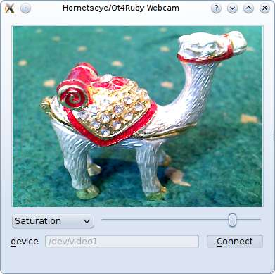

Applications
============

Video Thumbnails
----------------

EXR Viewer
----------

This is small viewer for displaying EXR images. The exposure can be modified with the slider.

The user interface was defined using Qt-Designer. The scroll area was defined by promoting a QFrame object to QScrollArea. See reference about using custom widgets for more information.

To use this application you need to install Qt4Ruby. You also need to compile the user interface description file first:

    rbuic4 exrviewer.ui > ui_exrviewer.rb

The UI file is available for download here: [exrviewer.ui](exrviewer.ui)

    require 'rubygems'
    require 'hornetseye_openexr'
    require 'hornetseye_rmagick'
    require 'hornetseye_qt4'
    require 'ui_exrviewer'
    include Hornetseye
    class EXRViewer < Qt::Widget
      slots 'load()'
      slots 'recompute()'
      def initialize( parent = nil )
        super parent
        @ui = Ui::EXRViewer.new
        @ui.setupUi self
        connect @ui.close_button, SIGNAL('clicked()'), self, SLOT('close()')
        connect @ui.load_button, SIGNAL('clicked()'), self, SLOT('load()')
        connect @ui.brightness_slider, SIGNAL('valueChanged(int)'),
                self, SLOT('recompute()')
        @arr = nil
        @channelmax = nil
        @label = Qt::Label.new
        @ui.scroll_area.setWidget @label
      end
      def load
        fileName = Qt::FileDialog.getOpenFileName self, "Load EXR File", "",
                                                  "EXR image (*.exr)"
        if fileName
          @arr = MultiArray.load_sfloatrgb fileName
          @max = proc { |x| [ x.r, x.g, x.b ].max }.call @arr.max
          @ui.brightness_slider.setEnabled true
          recompute
        end
      end
      def recompute
        factor = 2.0 ** ( @ui.brightness_slider.value / 4096.0 ) * 0xFF / @max
        image = ( @arr * factor ).minor( 0xFF ).to_ubytergb
        str = image.to_magick.to_blob do
          self.format = "PPM"
          self.depth = 8
        end
        pixmap = Qt::Pixmap.new
        pixmap.loadFromData Qt::ByteArray.fromRawData( str, str.size )
        @label.setPixmap pixmap
        @label.resize pixmap.width, pixmap.height
      end
    end
    app = Qt::Application.new ARGV
    viewer = EXRViewer.new
    viewer.show
    app.exec

XVideo Widget
-------------

The XVideo widget allows to use XVideo acceleration in a Qt4-QtRuby application. The example application shows how to write a small program for playing videos.

    require 'rubygems'
    require 'hornetseye_ffmpeg'
    require 'hornetseye_alsa'
    require 'hornetseye_qt4'
    VIDEO = ARGV[0] || 'http://ftp.halifax.rwth-aachen.de/blender/movies/sintel-1024-stereo.mp4'
    class Win < Qt::Widget
      slots 'seek(int)'
      def initialize
        super
        @screen = Hornetseye::XvWidget.new self
        @slider = Qt::Slider.new Qt::Horizontal
        layout = Qt::VBoxLayout.new self
        layout.addWidget @screen
        layout.addWidget @slider
        connect @slider, SIGNAL('valueChanged(int)'), self, SLOT('seek(int)')
        @seeking = true
        @video = nil
        @timer = 0
        start
        @slider.tracking = false
        @slider.minimum = 0
        @slider.single_step = 60
        @slider.page_step = 600
        if @video.duration
          @slider.maximum = @video.duration.to_i
        else
          @slider.maximum = ARGV[1] || 1
        end
        setWindowTitle 'XVideo'
      end
      def update_audio
        @audio_frame = @video.read_audio unless @audio_frame
        while @speaker.avail >= @audio_frame.shape[1]
          @speaker.write @audio_frame
          @audio_frame = @video.read_audio
        end
      end
      def update_video
        @screen.write @video.read_video
      end
      def timerEvent( e )
        begin
          update_audio
          update_video
          unless @slider.sliderDown
            @seeking = false
            p = @video.audio_pos.to_i
            @slider.maximum = p if p > @slider.maximum
            @slider.value = p
            @seeking = true
          end
          t = @video.audio_pos - @speaker.delay.quo( @speaker.rate )
          delay = [ 3.quo( 2 ) / @video.frame_rate, [ @video.video_pos - t, 0 ].max ].min
          killTimer @timer
          @timer = startTimer( ( delay * 1000 ).to_i )
        rescue Exception => e
          p e
          stop
        end
      end
      def start
        unless @video
          stop
          @video = Hornetseye::AVInput.new VIDEO
          @audio_frame = nil
          resize ( @video.width * @video.aspect_ratio ).to_i, @video.height
          @speaker = Hornetseye::AlsaOutput.new 'default:0', @video.sample_rate, @video.channels
          @timer = startTimer 0
        end
      end
      def stop
        @audio_frame = nil
        if @video
          @video.close
          @video = nil
        end
        if @speaker
          @speaker.close
          @speaker = nil
        end
        if @timer != 0
          killTimer @timer
          @timer = 0
          @screen.clear
        end
      end
      def seek( p )
        if @seeking
          begin
            start
            @audio_frame = nil
            @video.pos = p
            @speaker.drop
            @speaker.prepare
          rescue Exception => e
            p e
            stop
          end
        end
      end
    end
    app = Qt::Application.new ARGV
    Win.new.show
    app.exec

Webcam Viewer
-------------

This is an example using an XVideo widget to implement a webcam viewer. The viewer also has controls for a few camera features.

To use this application you need to install Qt4Ruby. You also need to compile the user interface description file first:

    rbuic4 webcam.ui > ui_webcam.rb

The UI file is available for download here: [webcam.ui](webcam.ui)

    require 'rubygems'
    require 'hornetseye_v4l2'
    require 'hornetseye_qt4'
    require 'ui_webcam'
    include Hornetseye
    app = Qt::Application.new ARGV
    class Webcam < Qt::Dialog
      slots 'open_camera()'
      slots 'set_brightness(int)'
      slots 'set_hue(int)'
      slots 'set_colour(int)'
      slots 'set_contrast(int)'
      def initialize( parent = nil )
        super parent
        @ui = Ui::WebcamWindow.new
        @ui.setupUi self
        @sliders = { @ui.brightnessSlider => V4L2Input::FEATURE_BRIGHTNESS,
                     @ui.hueSlider => V4L2Input::FEATURE_HUE,
                     @ui.colourSlider => V4L2Input::FEATURE_SATURATION,
                     @ui.contrastSlider => V4L2Input::FEATURE_CONTRAST }
        @xvwidget = XvWidget.new
        @ui.scrollArea.widget = @xvwidget
        connect @ui.reconnectButton, SIGNAL('clicked()'), self, SLOT('open_camera()')
        connect @ui.brightnessSlider, SIGNAL('valueChanged(int)'),
                self, SLOT('set_brightness(int)')
        connect @ui.hueSlider, SIGNAL('valueChanged(int)'),
                self, SLOT('set_hue(int)')
        connect @ui.colourSlider, SIGNAL('valueChanged(int)'),
                self, SLOT('set_colour(int)')
        connect @ui.contrastSlider, SIGNAL('valueChanged(int)'),
                self, SLOT('set_contrast(int)')
        @timer = 0
        open_camera
      end
      def open_camera
        @ui.errorLabel.text = ''
        begin
          if @input
            @input.close
            @input = nil
          end
          input = V4L2Input.new @ui.deviceEdit.text do |modes|
            modes.sort_by { |mode| ( mode.width - 640 ).abs }.first
          end
          input.read
          @sliders.each do |slider,feature|
            if input.feature_exist? feature
              slider.minimum = input.feature_min feature
              slider.maximum = input.feature_max feature
              slider.value = input.feature_read feature
              slider.enabled = true
            else
              slider.enabled = false
            end
          end
          @input = input
          @timer = startTimer 0 if @timer == 0
        rescue RuntimeError => e
          @ui.errorLabel.text = e.to_s
          @input = nil
        end
        @input
      end
      def set_brightness( value )
        @input.feature_write V4L2Input::FEATURE_BRIGHTNESS, value if @input
      end
      def set_hue( value )
        @input.feature_write V4L2Input::FEATURE_HUE, value if @input
      end
      def set_colour( value )
        @input.feature_write V4L2Input::FEATURE_SATURATION, value if @input
      end
      def set_contrast( value )
        @input.feature_write V4L2Input::FEATURE_CONTRAST, value if @input
      end
      def timerEvent( e )
        begin
          @xvwidget.write @input.read
        rescue RuntimeError => e
          killTimer @timer
          @timer = 0
        end
      end
    end
    win = Webcam.new
    win.show
    app.exec

2D Plot
-------

3D Plot
-------

Depth from Focus
----------------

Line Fit
--------

PCA Recognition
---------------

Phase Correlation
-----------------

Normalised Cross-Correlation
----------------------------

Mean Shift Tracking
-------------------

Camshift Tracking
-----------------

Lucas-Kanade Tracker
--------------------

EAN-13 Barcode Reader
---------------------

See Also
--------

* {Hornetseye::XvWidget}

External Links
--------------

