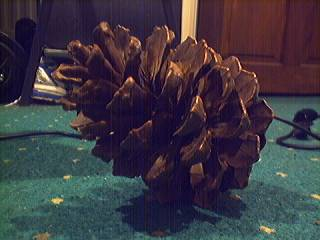
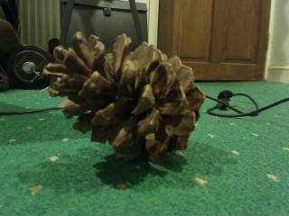

Capturing frames from a camera
==============================

Video for Linux (V4L)
---------------------

**HornetsEye** allows you to capture images using a V4L-capable device (for example a USB webcam). The example program opens a camera and displays the frames.

    require 'rubygems'
    require 'hornetseye_v4l'
    require 'hornetseye_xorg'
    include Hornetseye
    input = V4LInput.new
    X11Display.show { input.read }

Note that V4L is deprecated and it does not support recent cameras. You should use V4L2 instead.

Video for Linux Version 2 (V4L2)
--------------------------------

**HornetsEye** allows you to capture images using a V4L2-capable device (for example a USB webcam).

### Basic example

The basic example program opens a camera and displays the frames.

    require 'rubygems'
    require 'hornetseye_v4l2'
    require 'hornetseye_xorg'
    include Hornetseye
    input = V4L2Input.new
    X11Display.show { input.read }

### Selecting a video mode

This is a more sophisticated example. It opens the first V4L2 camera and then it prompts the user to select one of the video modes offered by the camera. Finally the program displays the frames.

    require 'rubygems'
    require 'hornetseye_v4l2'
    require 'hornetseye_xorg'
    include Hornetseye
    camera = V4L2Input.new '/dev/video0' do |modes|
      modes.each_with_index { |mode,i| puts "#{i + 1}: #{mode}" }
      modes[STDIN.readline.to_i - 1]
    end
    X11Display.show { camera.read }

See Also
--------

* {Hornetseye::V4LInput}
* {Hornetseye::V4L2Input}
* {Hornetseye::DC1394Input}

External Links
--------------

* [V4L](http://www.exploits.org/v4l/)
* [V4L2](http://v4l2spec.bytesex.org/)

