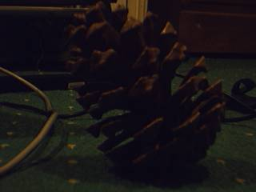

Capturing frames from a camera
==============================

Video for Linux (V4L)
---------------------

**HornetsEye** allows you to capture images using a V4L-capable device (for example a USB webcam). Note that V4L is deprecated and it does not support recent cameras. You should use V4L2 instead.

### Basic example

The example program opens a camera and displays the frames.

    require 'rubygems'
    require 'hornetseye_v4l'
    require 'hornetseye_xorg'
    include Hornetseye
    camera = V4LInput.new
    X11Display.show { camera.read }

### Specifying a preferred video mode

V4L does not offer information about the video resolutions supported by the camera. However it is possible to specify a desired resolution. In the following example a specific colourspace is enforced as well.

    require 'rubygems'
    require 'hornetseye_v4l'
    require 'hornetseye_xorg'
    include Hornetseye
    camera = V4LInput.new '/dev/video0', 0, V4LInput::PAL, 320, 240, V4LInput::I420
    X11Display.show { camera.read }

Video for Linux Version 2 (V4L2)
--------------------------------

**HornetsEye** allows you to capture images using a V4L2-capable device (for example a USB webcam or a frame grabber).

### Basic example

The basic example program opens a camera and displays the frames.

    require 'rubygems'
    require 'hornetseye_v4l2'
    require 'hornetseye_xorg'
    include Hornetseye
    camera = V4L2Input.new
    X11Display.show { camera.read }

### Selecting a video mode

This is a more sophisticated example. It opens the first V4L2 camera and then it prompts the user to select one of the video modes offered by the camera. Finally the program displays the frames.

    require 'rubygems'
    require 'hornetseye_v4l2'
    require 'hornetseye_xorg'
    include Hornetseye
    camera = V4L2Input.new '/dev/video0' do |modes|
      modes.each_with_index { |mode,i| puts "#{i + 1}: #{mode}" }
      modes[STDIN.readline.to_i - 1]
    end
    X11Display.show { camera.read }

Firewire Digital Camera (DC1394)
--------------------------------

**HornetsEye** also supports capture from DC1394-compatible firewire digital cameras.

### Basic Example

    require 'rubygems'
    require 'hornetseye_dc1394'
    require 'hornetseye_xorg'
    include Hornetseye
    camera = DC1394Input.new
    X11Display.show { camera.read }

### Selecting a video mode

In this example the user is prompted to select a video mode offered by the camera.

    require 'rubygems'
    require 'hornetseye_dc1394'
    require 'hornetseye_xorg'
    include Hornetseye
    camera = DC1394Input.new 0 do |modes|
      modes.each_with_index { |mode,i| puts "#{i + 1}: #{mode}" }
      modes[STDIN.readline.to_i - 1]
    end
    X11Display.show { camera.read }

Microsoft Kinect (libfreenect)
------------------------------

Using the libfreenect bindings one can capture RGB and 11-bit depth images with a Microsoft Kinect sensor.

    require 'rubygems'
    require 'hornetseye_kinect'
    require 'hornetseye_xorg'
    include Hornetseye
    class Numeric
      def clip( range )
        [ [ self, range.begin ].max, range.end ].min
      end
    end
    colours = Sequence.ubytergb 256
    for i in 0...256
      hue = 240 - i * 240.0 / 256.0
      colours[i] =
        RGB( ( ( hue - 180 ).abs -  60 ).clip( 0...60 ) * 0xFF / 60.0,
             ( 120 - ( hue - 120 ).abs ).clip( 0...60 ) * 0xFF / 60.0,
             ( 120 - ( hue - 240 ).abs ).clip( 0...60 ) * 0xFF / 60.0 )
    end
    input = KinectInput.new
    display = X11Display.new
    output_depth, output_video = XImageOutput.new, XVideoOutput.new
    window_depth = X11Window.new display, output_depth, 640, 480
    window_video = X11Window.new display, output_video, 640, 480
    window_depth.title = 'Depth'
    window_video.title = 'Video'
    window_depth.show
    window_video.show
    input.led = KinectInput::LED_RED
    while display.status?
      input.tilt = 0.0
      input.get_state
      moving = input.tilt_status == KinectInput::TILT_STATUS_MOVING
      input.led = moving ? KinectInput::LED_RED : KinectInput::LED_GREEN
      output_video.write input.read_video
      output_depth.write( ( input.read_depth >> 3 ).lut colours )
      display.process_events
    end

See Also
--------

* {Hornetseye::V4LInput}
* {Hornetseye::V4L2Input}
* {Hornetseye::DC1394Input}

External Links
--------------

* [V4L](http://www.exploits.org/v4l/)
* [V4L2](http://v4l2spec.bytesex.org/)
* [libdc1394](http://damien.douxchamps.net/ieee1394/libdc1394/)
* [DC1394 camera list](http://damien.douxchamps.net/ieee1394/cameras/)

