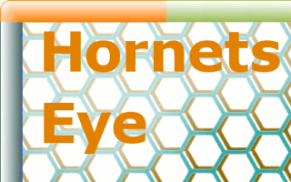

Credits
=======

Yukihiro Matsumoto and his team are providing a proper programming language with a simple way of interfacing with native code.

Masahiro Tanaka develops NArray which offers great ideas on how to do image processing with Ruby.

Greg Valure is the developer of NaturalDocs which is used to generate this webpage.

The folks at [Demon](http://www.demon.net/) are hosting this webpage.

This project makes use of free hosting at [RubyForge](http://rubyforge.org/), [Sourceforge](http://sourceforge.net/), [Launchpad](http://launchpad.net/), and [Github](http://github.com/).

Thanks to Ashley Moran and Jag Gill for organizing the 7th Sheffield Ruby User Group meeting and letting me present HornetsEye there.

The conference organizers from OSCON 2008 accepted my proposal to give a talk and this gives this project a boost in popularity.

Thanks to Klaus Treichel, Aleksey Demakov, and Kirill Kononenko for their valuable support with libJIT.

Thanks to Damien Douxchamps for his support with libdc1394.

Thanks to Richard Dale for his support with qt4-qtruby.

Paul Brannan develops ruby-libjit and the libjit interface of HornetsEye follows the pattern of ruby-libjit.

Thanks to Caleb Clausen for helping me with Rubygems.

The phase correlation example is based on Dennis Tessier's work.

Hussein Abdul-Rahman contributed the initial version (two-dimensional) of the connected-component analysis.

The interactive presentation software is based on the experience gained in a previous project by Juan Roldan, Ushakiran Soutapalli, Julien Faucher, and Claudia Amico.

Kim Chuan Lim implemented various sub-pixel corner detection algorithms with Ruby.

Aiden Lockwood implemented software for operating a transmission electron microscope using Ruby and HornetsEye. Jing Jing Wang, Jong Peng, and Ralph Gay helped understanding the controller.

Géraud De La Mensbruge used HornetsEye for inspection of industrial SMT nozzles.

Chinwe Lucy Ozoegwu implemented a graphical user interface for displaying, processing, and recording of infrared videos.

Sonia Fernández Rodríguez did an implementation of the RANSAC algorithm with Ruby.

Bala Amavasai developed a large part of the Mimas library and he organised the Nanorobotics grant. HornetsEye benefits a lot from experience gained during the development of the Mimas C++ computer vision library.

Jan Wedekind initiated this project and currently is the main developer of this software.

Thanks to the members of the Microsystems and Machine Vision Laboratory for their suggestions, support, and for using this software ;)

The people at Sheffield Hallam University and the Materials and Engineering Research Institute are supporting us and there is a long lasting commitment to free software by management.

There are a lot of developers who have developed other open-source software on which this library is based upon.

Thanks to all developers using this library for their valuable feedback!

Part of the work was funded by the [EPSRC Nanorobotics Basic Technology grant](http://gow.epsrc.ac.uk/ViewGrant.aspx?GrantRef=GR/S85696/01).

