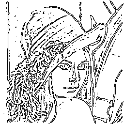
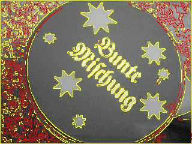
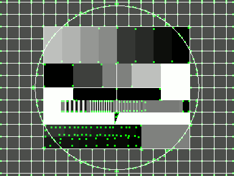

Feature Extraction
==================

Sobel Gradient Magnitude
------------------------

In the following example the sobel gradient magnitude is computed.

    require 'hornetseye_v4l2'
    require 'hornetseye_xorg'
    include Hornetseye
    class Node
      def sobel_norm
        Math.sqrt sobel(0) ** 2 + sobel(1) ** 2
      end
    end
    input = V4L2Input.new
    X11Display.show { input.read_ubyte.sobel_norm.normalise 255 .. 0 }

Roberts Cross Edge Detector
---------------------------

Roberts cross edge detector consists of two small filters. The image is correlated with both filters. The final edge image is computed by taking the sum of the two correlation results.

    require 'hornetseye_rmagick'
    require 'hornetseye_xorg'
    include Hornetseye
    class Node
      def roberts
        filter1 = MultiArray(SINT, 2)[[-1,  0], [0, 1]]
        filter2 = MultiArray(SINT, 2)[[ 0, -1], [1, 0]]
        convolve(filter1).abs + convolve(filter2).abs
      end
    end
    img = MultiArray.load_ubyte 'http://www.wedesoft.de/hornetseye-api/images/grey.png'
    img.roberts.normalise(0xFF .. 0).show

Difference of Gaussian
----------------------

The difference of Gaussian is simply the difference of two Gaussian filters of different size.

    require 'hornetseye_rmagick'
    require 'hornetseye_xorg'
    include Hornetseye
    img = MultiArray.load_ubytergb 'http://www.wedesoft.de/hornetseye-api/images/colour.png'
    dog = img.gauss_blur(1.5) - img.gauss_blur(3.0)
    dog.normalise.show

Laplacian of Gaussian
---------------------

The LoG-filter creates an image with zero-crossings at edge locations. The edges can be detected using either dilation or erosion. Alternatively one could match a set of small 3x3 patterns. The notable property of edge detection using the LoG-filter is that it generates closed edge contours.

    require 'hornetseye_xorg'
    require 'hornetseye_rmagick'
    include Hornetseye
    img = MultiArray.load_ubyte 'http://www.wedesoft.de/hornetseye-api/images/lena.jpg'
    log = MultiArray.laplacian_of_gaussian 1.4, 9
    binary = img.convolve(log) >= 0
    binary.not.or(binary.erode).conditional(0xFF, 0).show

Canny Edge Detector
-------------------

The Canny edge detector uses two thresholds. The gradient norm is used to select edges. The gradient orientation is used to perform non-maxima suppression for edges. Edges are suppressed if the gradient is below the high threshold and the edge is not connected to edges with a gradient norm surpassing the high threshold. The Canny algorithm requires tracing along the edges. Here full connectivity is used instead.

    require 'hornetseye_v4l2'
    require 'hornetseye_xorg'
    include Hornetseye
    HIGH = 6.0
    LOW = 0.75
    input = V4L2Input.new
    w, h = input.width, input.height
    X11Display.show do
      img = input.read_ubyte
      x = img.gauss_gradient 1.4, 0, 0.5
      y = img.gauss_gradient 1.4, 1, 0.5
      norm = Math.hypot x, y
      angle = Math.atan2 y, x
      orientation = ((2 * Math::PI - Math::PI / 8 + angle) * (4 / Math::PI)).to_ubyte % 4
      idx, idy = lazy(w, h) { |i,j| i }, lazy(w, h) { |i,j| j }
      dx, dy = orientation.lut(Sequence[-1, 0, 1, 1]), orientation.lut(Sequence[-1, -1, -1, 0])
      low = norm >= norm.warp(idx + dx, idy + dy).major(norm.warp(idx - dx, idy - dy)).major(LOW)
      high = norm >= HIGH
      comp = low.components
      hist = comp.histogram comp.max + 1, :weight => high.to_int
      edges = low.and comp.lut(hist > 0)
      edges.conditional high.conditional(RGB(255, 255, 0), RGB(255, 0, 0)), img
    end

Corner Strength by Yang et al.
------------------------------

The following program computes the corner strength measure by Yang, Burger, Firmin, and Underwood.

    require 'hornetseye_rmagick'
    require 'hornetseye_xorg'
    include Hornetseye
    GRAD_SIGMA = 2.0
    COV_SIGMA = 1.0
    NOISE = 1.0
    EXP = 0.5
    img = MultiArray.load_ubyte 'http://www.wedesoft.de/hornetseye-api/images/grey.png'
    x = img.gauss_gradient GRAD_SIGMA, 0
    y = img.gauss_gradient GRAD_SIGMA, 1
    a = (x * x).gauss_blur COV_SIGMA
    b = (y * y).gauss_blur COV_SIGMA
    c = (x * y).gauss_blur COV_SIGMA
    g = ((a - b) ** 2 + (2 * c) ** 2) / (a + b + NOISE ** 2) ** 2
    result = g.normalise(1.0 .. 0.0) ** EXP * (x ** 2 + y ** 2)
    result.normalise(0xFF .. 0).show

Harris-Stephens Corner- and Edge-Detector
-----------------------------------------

This program implements the Harris-Stephens corner- and edge-detector. In the resulting image corners will appear white while edges will become black.

    require 'hornetseye_rmagick'
    require 'hornetseye_xorg'
    include Hornetseye
    GRAD_SIGMA = 1
    COV_SIGMA = 1
    K = 0.05
    img = MultiArray.load_ubyte 'http://www.wedesoft.de/hornetseye-api/images/grey.png'
    x = img.gauss_gradient GRAD_SIGMA, 0
    y = img.gauss_gradient GRAD_SIGMA, 1
    a = (x * x).gauss_blur COV_SIGMA
    b = (y * y).gauss_blur COV_SIGMA
    c = (x * y).gauss_blur COV_SIGMA
    tr = a + b
    det = a * b - c * c
    r = det - tr * tr * K
    r.normalise.show

Shi-Tomasi Corner Detector
--------------------------

Here is an implementation of the Shi-Tomasi corner-detector.

    require 'hornetseye_rmagick'
    require 'hornetseye_xorg'
    include Hornetseye
    GRAD_SIGMA = 1
    COV_SIGMA = 1
    img = MultiArray.load_ubyte 'http://www.wedesoft.de/hornetseye-api/images/grey.png'
    x = img.gauss_gradient GRAD_SIGMA, 0
    y = img.gauss_gradient GRAD_SIGMA, 1
    a = (x * x).gauss_blur COV_SIGMA
    b = (y * y).gauss_blur COV_SIGMA
    c = (x * y).gauss_blur COV_SIGMA
    tr = a + b
    det = a * b - c * c
    # "major" is needed to deal with numerical errors.
    dissqrt = Math.sqrt((tr * tr - det * 4).major(0.0))
    # Take smallest eigenvalue. Eigenvalues are "0.5 * (tr +- dissqrt)"
    result = 0.5 * (tr - dissqrt)
    result.normalise(0xFF .. 0).show

Feature Locations
-----------------

Usually computing a feature image is not enough and one needs to determine the locations of the most prominent features. This can be achieved by thresholding the image and then locating the maxima (i.e. performing non-maxima suppression for corners). HornetsEye does not support non-maxima suppression directly. However one can use greylevel dilation followed by masking as shown below.

    require 'hornetseye_rmagick'
    require 'hornetseye_xorg'
    include Hornetseye
    class Node
      def nms(threshold = 0.05)
        self >= dilate.major(threshold)
      end
      def harris(sigma_grad = 1.0, sigma_avg = 1.0, k = 0.05)
        x, y = gauss_gradient(sigma_grad, 0), gauss_gradient(sigma_grad, 1)
        a = (x * x).gauss_blur sigma_avg
        b = (y * y).gauss_blur sigma_avg
        c = (x * y).gauss_blur sigma_avg
        tr = a + b
        det = a * b - c * c
        det - tr * tr * k
      end
    end
    img = MultiArray.load_ubyte 'http://www.wedesoft.de/hornetseye-api/images/grey.png'
    img.harris.nms.dilate(3).conditional(RGB(0, 255, 0), img).show

See Also
--------

* {Hornetseye::Node#convolve}
* {Hornetseye::Node#sobel}
* {Hornetseye::Node#gauss_blur}
* {Hornetseye::Node#gauss_gradient}

External Links
--------------

* [Sobel operator](http://en.wikipedia.org/wiki/Sobel_operator)
* [Roberts cross edge detector](http://homepages.inf.ed.ac.uk/rbf/HIPR2/roberts.htm)
* [Canny edge detector](http://en.wikipedia.org/wiki/Canny_edge_detector)
* [Corner detection](http://en.wikipedia.org/wiki/Corner_detection)
* [Difference of Gaussian](http://en.wikipedia.org/wiki/Difference_of_Gaussians)
* [Corner strength by Yang et al.](http://pubs.doc.ic.ac.uk/structure-anisotropic-image/)
* [Harris-Stephens corner- and edge detector](www.bmva.org/bmvc/1988/avc-88-023.pdf)
* [Kanade-Lucas-Tomasi feature tracker](http://www.ces.clemson.edu/~stb/klt/)

