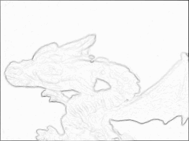
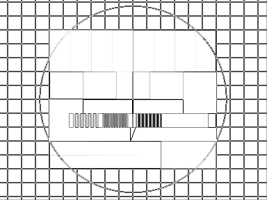
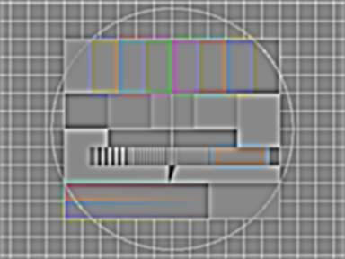
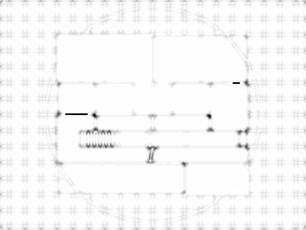
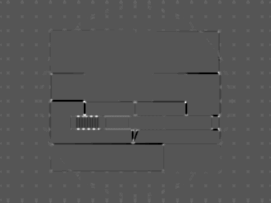
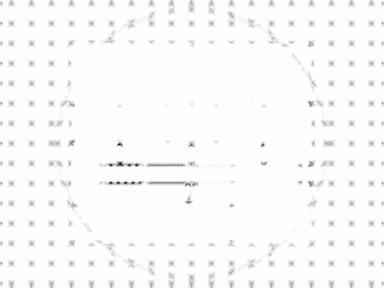

Feature Extraction
==================

Sobel Gradient Magnitude
------------------------

In the following example the sobel gradient magnitude is computed.

    require 'rubygems'
    require 'hornetseye_rmagick'
    require 'hornetseye_xorg'
    include Hornetseye
    class Node
      def sobel_mag
        Math.sqrt lazy { sobel( 0 ) ** 2 + sobel( 1 ) ** 2 }
      end
    end
    img = MultiArray.load_ubyte 'http://www.wedesoft.demon.co.uk/hornetseye-api/images/grey.png'
    img.sobel_mag.normalise( 255 .. 0 ).show

Roberts Cross Edge Detector
---------------------------

Roberts cross edge detector consists of two small filters. The image is correlated with both filters. The final edge image is computed by taking the sum of the two correlation results.

    require 'rubygems'
    require 'hornetseye_rmagick'
    require 'hornetseye_xorg'
    include Hornetseye
    class Node
      def roberts
        filter1 = MultiArray( SINT, 2, 2 )[ [ -1,  0 ], [ 0, 1 ] ]
        filter2 = MultiArray( SINT, 2, 2 )[ [  0, -1 ], [ 1, 0 ] ]
        finalise { convolve( filter1 ).abs + convolve( filter2 ).abs }
      end
    end
    img = MultiArray.load_ubyte 'http://www.wedesoft.demon.co.uk/hornetseye-api/images/grey.png'
    img.roberts.normalise( 0xFF .. 0 ).show

Difference of Gaussian
----------------------

The difference of Gaussian is simply the difference of two Gaussian filters of different size.

    require 'rubygems'
    require 'hornetseye_rmagick'
    require 'hornetseye_xorg'
    include Hornetseye
    img = MultiArray.load_ubytergb 'http://www.wedesoft.demon.co.uk/hornetseye-api/images/colour.png'
    dog = img.gauss_blur( 1.5 ) - img.gauss_blur( 3.0 )
    dog.normalise.show

Laplacian of Gaussian
---------------------

Corner Strength by Yang et al.
------------------------------

The following program computes the corner strength measure by Yang, Burger, Firmin, and Underwood.

    require 'rubygems'
    require 'hornetseye_rmagick'
    require 'hornetseye_xorg'
    include Hornetseye
    GRAD_SIGMA = 2.0
    COV_SIGMA = 1.0
    NOISE = 1.0
    EXP = 0.5
    img = MultiArray.load_ubyte 'http://www.wedesoft.demon.co.uk/hornetseye-api/images/grey.png'
    x = img.gauss_gradient GRAD_SIGMA, 0
    y = img.gauss_gradient GRAD_SIGMA, 1
    a = ( x ** 2 ).gauss_blur COV_SIGMA
    b = ( y ** 2 ).gauss_blur COV_SIGMA
    c = ( x * y  ).gauss_blur COV_SIGMA
    g = ( ( a - b ) ** 2 + ( 2 * c ) ** 2 ) / ( a + b + NOISE ** 2 ) ** 2
    result = g.normalise( 1.0 .. 0.0 ) ** EXP * ( x ** 2 + y ** 2 )
    result.normalise( 0xFF .. 0 ).show

Harris-Stephens Corner- and Edge-Detector
-----------------------------------------

This program implements the Harris-Stephens corner- and edge-detector. In the resulting image corners will appear white while edges will become black.

    require 'rubygems'
    require 'hornetseye_rmagick'
    require 'hornetseye_xorg'
    include Hornetseye
    GRAD_SIGMA = 1
    COV_SIGMA = 1
    K = 0.05
    img = MultiArray.load_ubyte 'http://www.wedesoft.demon.co.uk/hornetseye-api/images/grey.png'
    x = img.gauss_gradient GRAD_SIGMA, 0
    y = img.gauss_gradient GRAD_SIGMA, 1
    a = ( x ** 2 ).gauss_blur COV_SIGMA
    b = ( y ** 2 ).gauss_blur COV_SIGMA
    c = ( x * y  ).gauss_blur COV_SIGMA
    tr = a + b
    det = a * b - c * c
    r = det - tr * tr * K
    r.normalise.show

Shi-Tomasi Corner Detector
--------------------------

Here is an implementation of the Shi-Tomasi corner-detector.

    require 'rubygems'
    require 'hornetseye_rmagick'
    require 'hornetseye_xorg'
    include Hornetseye
    GRAD_SIGMA = 1
    COV_SIGMA = 1
    img = MultiArray.load_ubyte 'http://www.wedesoft.demon.co.uk/hornetseye-api/images/grey.png'
    x = img.gauss_gradient GRAD_SIGMA, 0
    y = img.gauss_gradient GRAD_SIGMA, 1
    a = ( x ** 2 ).gauss_blur COV_SIGMA
    b = ( y ** 2 ).gauss_blur COV_SIGMA
    c = ( x * y  ).gauss_blur COV_SIGMA
    tr = a + b
    det = a * b - c * c
    # "major" is needed to deal with numerical errors.
    dissqrt = Math.sqrt( ( tr * tr - det * 4 ).major( 0.0 ) )
    # Take smallest eigenvalue. Eigenvalues are "0.5 * ( tr +- dissqrt)"
    result = 0.5 * ( tr - dissqrt )
    result.normalise( 0xFF .. 0 ).show

Feature Locations
-----------------

See Also
--------

* {Hornetseye::Operations#convolve}
* {Hornetseye::Operations#sobel}
* {Hornetseye::Operations#gauss_blur}
* {Hornetseye::Operations#gauss_gradient}

External Links
--------------

* [Sobel operator](http://en.wikipedia.org/wiki/Sobel_operator)
* [Roberts cross edge detector](http://homepages.inf.ed.ac.uk/rbf/HIPR2/roberts.htm)
* [Corner detection](http://en.wikipedia.org/wiki/Corner_detection)
* [Difference of Gaussian](http://en.wikipedia.org/wiki/Difference_of_Gaussians)
* [Corner strength by Yang et al.](http://pubs.doc.ic.ac.uk/structure-anisotropic-image/)
* [Harris-Stephens corner- and edge detector](www.bmva.org/bmvc/1988/avc-88-023.pdf)
* [Kanade-Lucas-Tomasi feature tracker](http://www.ces.clemson.edu/~stb/klt/)

