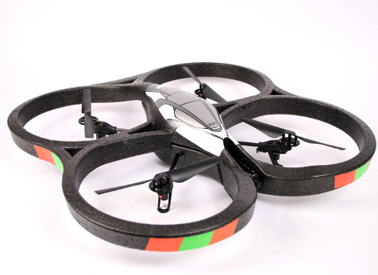
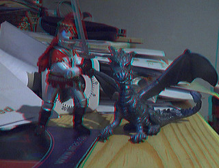

Reading and Writing Video Files
===============================

Read Video Data
----------------

The class {Hornetseye::AVInput} allows you to capture frames from videos using the [FFMpeg library](http://www.ffmpeg.org/). The example program shows how to display a video.

    require 'rubygems'
    require 'hornetseye_ffmpeg'
    require 'hornetseye_xorg'
    include Hornetseye
    input = AVInput.new 'http://peach.themazzone.com/durian/movies/sintel-1024-surround.mp4'
    w, h = (input.width * input.aspect_ratio).to_i, input.height
    X11Display.show(w, h, :frame_rate => input.frame_rate) { input.read }

Using FFMpeg it is also possible to decode H.264 live streams. Here is an example to read and display the video stream from a [Parrot AR.Drone 2.0](http://ardrone2.parrot.com/) with a small Ruby program.

    require 'rubygems'
    require 'hornetseye_ffmpeg'
    require 'hornetseye_xorg'
    include Hornetseye
    input = AVInput.new 'tcp://192.168.1.1:5555'
    X11Display.show { input.read }

Read Audio Data
---------------

The following example reads data from an audio file. The data is written to the audio output device. Note that currently one has to catch the exception occurring at the end of the stream.

    require 'rubygems'
    require 'hornetseye_ffmpeg'
    require 'hornetseye_alsa'
    include Hornetseye
    input = AVInput.new 'http://www.kozco.com/tech/LRMonoPhaset4.wav'
    alsa = AlsaOutput.new 'default', input.sample_rate, input.channels
    begin
      while true
        alsa.write input.read
      end
    rescue RuntimeError
    end

Read Video and Audio Data
-------------------------

It is also possible to retrieve audio frames if the video file offers an audio stream. The audio frames are two-dimensional arrays with the first dimension indicating the number of audio channels (*i.e.* 1=mono, 2=stereo). The following example plays synchronised video and audio.

    require 'rubygems'
    require 'hornetseye_ffmpeg'
    require 'hornetseye_xorg'
    require 'hornetseye_alsa'
    include Hornetseye
    input = AVInput.new 'http://peach.themazzone.com/durian/movies/sintel-1024-surround.mp4'
    w, h = (input.width * input.aspect_ratio).to_i, input.height
    alsa = AlsaOutput.new 'default', input.sample_rate, input.channels
    audio_frame = input.read_audio
    X11Display.show w, h, :title => 'FFMpeg', :output => XVideoOutput do |display|
      video_frame = input.read_video
      while input.audio_pos < input.video_pos + 0.2
        alsa.write audio_frame
        audio_frame = input.read_audio
      end
      t = input.audio_pos - (alsa.delay + audio_frame.shape[1]).quo( alsa.rate )
      display.event_loop [ input.video_pos - t, 0 ].max
      video_frame
    end

Record Video and Audio
----------------------

This example is about recording audio and video in real-time. The frame rate needs to be specified ahead of time. It might be necessary to reduce the value if the camera or the computer are too slow.

    require 'rubygems'
    require 'hornetseye_v4l2'
    require 'hornetseye_alsa'
    require 'hornetseye_xorg'
    require 'hornetseye_ffmpeg'
    include Hornetseye
    FRAME_RATE = 8
    camera = V4L2Input.new '/dev/video0' do |modes|
      modes.each_with_index do |mode,i|
        puts "#{i+1}. #{mode.inspect}"
      end
      modes[STDIN.readline.to_i - 1]
    end
    w, h = camera.width, camera.height
    audio = AlsaInput.new 'default'
    output = AVOutput.new 'test.avi',
      4000000, w, h, FRAME_RATE, 1, AVOutput::CODEC_ID_MPEG4,
      true, 128000, audio.rate, audio.channels, AVOutput::CODEC_ID_MP3
    t = Time.new.to_f
    c = 0
    X11Display.show w, h, :title => 'FFMpeg', :output => XVideoOutput do
      img = camera.read
      output.write_video img
      output.write_audio audio.read(audio.rate / FRAME_RATE)
      c += 1
      puts c / (Time.new.to_f - t) if c % FRAME_RATE == 0
      img
    end

Anaglyph Videos
---------------

One can download [3D stereo videos from Youtube](http://www.youtube.com/3d) and convert them to a red-cyan [anaglyph](http://en.wikipedia.org/wiki/Anaglyph_image) video as follows. To download videos from Youtube, one can can use the [Unplug](https://addons.mozilla.org/firefox/addon/unplug/) add-on for Firefox.

    require 'hornetseye_ffmpeg'
    require 'hornetseye_xorg'
    include Hornetseye
    raise "Syntax: ./anaglyph [input] [output]" if ARGV.size != 2
    input = AVInput.new ARGV[0]
    w2, h2 = input.width, input.height
    w, h = w2 / 2, h2 # h2 * 2 / 3
    output = AVOutput.new ARGV[1], 4000000, w, h, input.frame_rate, 1, nil, true, 128000,
                          input.sample_rate, input.channels, nil
    y = (h2 - h) / 2
    X11Display.show do
      img = input.read_video.to_ubytergb
      begin
        output.write_audio input.read_audio
      end while input.audio_pos < input.video_pos
      left  = img[0 ...  w, y ... y + h]
      right = img[w ... w2, y ... y + h]
      result = MultiArray.ubytergb w, h
      result.r, result.g, result.b = left.r, right.g / 2, right.b / 2
      output.write_video result
    end

See also
--------

* {Hornetseye::AVInput}
* {Hornetseye::AVOutput}

External Links
--------------

* [FFMpeg audio/video codec library](http://www.ffmpeg.org/)
* [Sintel, the Durian Open Movie Project](http://sintel.org/)
* [Youtube 3D](http://www.youtube.com/3d)
* [Anaglyph images](http://en.wikipedia.org/wiki/Anaglyph_image)
* [Unplug (add-on for Firefox)](https://addons.mozilla.org/firefox/addon/unplug/)

