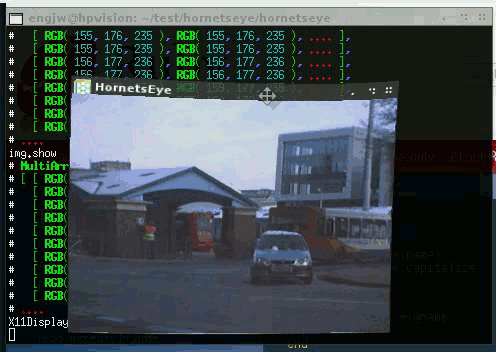
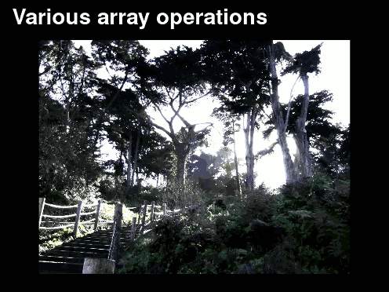

Features
========

HornetsEye offers image file-I/O, video input, access to webcams and framegrabbers, and access to firewire digital cameras by leveraging existing free software libraries. Furthermore **HornetsEye** has comprehensive support for array operations, e.g. element-wise unary and binary operations, folding, correlation, array views, custom element types, morphological operations, index operations, masks, and warps. It thightly integrates with existing Ruby extensions. Check out the demonstration videos below.

Demonstration Videos
--------------------

### Interactive Development

After installation you can use **HornetsEye** without having to compile or link anything! You can even develop computer vision algorithms on the command-line using [Interactive Ruby](http://en.wikipedia.org/wiki/Interactive_Ruby_Shell).

**See also**

* [HornetsEye Interactive Ruby demonstration](http://vision.eng.shu.ac.uk/jan/hornetseye-demo.avi "26 MByte demo video") (also available at [Youtube](http://www.youtube.com/watch?v=5xJa2ytsE7I "HornetsEye Interactive Ruby demonstration"))
* [Audio track of demo video](http://ccmixter.org/files/Nurykabe/16646 "Morusque - Funki good time")

### I/O and Array Operation

HornetsEye provides generic array operations and it offers a comprehensive set of I/O interfaces.

* [HornetsEye Interactive Ruby demonstration](http://vision.eng.shu.ac.uk/jan/hornetseye2010.avi "48 MByte demo video") (also available at [Youtube](http://www.youtube.com/watch?v=wNFr7RNWeCs "HornetsEye demonstration video"))
* [Audio track of demo video](http://ccmixter.org/files/Tekno_Eddy/14488 "Tekno Eddy - Depart")

