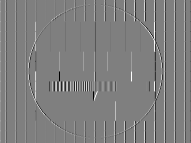

Filters
=======

Sobel Operator
--------------

### X-Gradient

This is an example on how to compute the Sobel x-gradient. A correlation of the input image with the following separable filter is performed.

    require 'rubygems'
    require 'hornetseye_rmagick'
    require 'hornetseye_xorg'
    include Hornetseye
    img = MultiArray.load_ubyte 'http://www.wedesoft.demon.co.uk/hornetseye-api/images/grey.png'
    img.sobel( 0 ).normalise.show

### Y-Gradient

This is an example on how to compute the Sobel y-gradient. A correlation of the input image with the following separable filter is performed.

    require 'rubygems'
    require 'hornetseye_rmagick'
    require 'hornetseye_xorg'
    include Hornetseye
    img = MultiArray.load_ubyte 'http://www.wedesoft.demon.co.uk/hornetseye-api/images/grey.png'
    img.sobel( 1 ).normalise.show

Gaussian Blur
-------------

This is an example on how to apply a Gauss blur filter. The filter can be applied to colour images as well.

    require 'rubygems'
    require 'hornetseye_rmagick'
    require 'hornetseye_xorg'
    include Hornetseye
    img = MultiArray.load_ubytergb 'http://www.wedesoft.demon.co.uk/hornetseye-api/images/lena.jpg'
    img.gauss_blur( 3.0 ).show

Van Cittert Deconvolution
-------------------------

Van Cittert deconvolution is an iterative algorithm for reversing a convolution with a known point spread function. To demonstrate the algorithm, the result of the Gaussian blur is used. The Van Cittert algorithm then is applied to this image to estimate the original input image. The first iteration of the algorithm uses the blurred image as an estimate.

    require 'rubygems'
    require 'hornetseye_rmagick'
    require 'hornetseye_xorg'
    include Hornetseye
    SIGMA = 3.0
    N = 20
    img = MultiArray.load_ubytergb( 'http://www.wedesoft.demon.co.uk/hornetseye-api/images/lena.jpg' ).gauss_blur( SIGMA ).to_ubytergb
    g = img.to_sfloatrgb
    N.times { g = img + g - g.gauss_blur( SIGMA ) }
    g.clip.show

Wiener Filter
-------------

The Wiener filter is the optimal linear filter for denoising and deblurring. The filter requires prior knowledge about the autospectrum of the signal, the point spread function of the blur, and the autospectrum of the noise. In this example white noise is assumed. To demonstrate the algorithm, a Gaussian blur is applied to the input image and the Wiener filter is used to estimate the input signal.

    require 'rubygems'
    require 'hornetseye_fftw3'
    require 'hornetseye_rmagick'
    require 'hornetseye_xorg'
    include Hornetseye
    class Node
      def radius
        w, h = *shape
        lazy w, h do |i,j|
          Math.sqrt( ( i - w / 2 ) **2 + ( j - h / 2 ) ** 2 )
        end
      end
      def spectrum( alpha )
        w, h = *shape
        ( 255.0 / ( 1.0 + ( radius / alpha ) ** 2 ) ).shift -w / 2, -h / 2
      end
      def blur( sigma )
        w, h = *shape
        retval = MultiArray.ubyte( w, h ).fill!
        retval[ w / 2, h / 2 ] = 1
        retval.gauss_blur( sigma ).shift -w / 2, -h / 2
      end
      def wiener( alpha, noise, sigma = nil )
        if typecode < RGB_
          result = MultiArray(typecode.float, dimension).new *shape
          result.r, result.g, result.b = [ r, g, b ].collect do |c|
            c.wiener alpha, noise, sigma
          end
          result
        else
          si = spectrum( alpha ) ** 2
          if sigma
            bf = blur( sigma ).fft
            ( bf.conj * si / ( bf.abs ** 2 * si + noise ** 2 ) * fft ).ifft.real
          else
            ( si / ( si + noise ** 2 ) * fft ).ifft.real
          end
        end
      end
    end
    NOISE = 2.0
    SIGMA = 3.0
    img = MultiArray.load_ubytergb( 'http://www.wedesoft.demon.co.uk/hornetseye-api/images/lena.jpg' ).gauss_blur( SIGMA ).to_ubytergb
    img.wiener( img.shape[0] * 0.1, NOISE, SIGMA ).clip.show

Gauss Gradient
--------------

### X-Gradient

This is an example on how to compute the Gaussian x-gradient.

    require 'rubygems'
    require 'hornetseye_rmagick'
    require 'hornetseye_xorg'
    include Hornetseye
    img = MultiArray.load_ubytergb 'http://www.wedesoft.demon.co.uk/hornetseye-api/images/lena.jpg'
    img.gauss_gradient( 3.0, 0 ).normalise.show

### Y-Gradient

This is an example on how to compute the Gaussian y-gradient.

    require 'rubygems'
    require 'hornetseye_rmagick'
    require 'hornetseye_xorg'
    include Hornetseye
    img = MultiArray.load_ubytergb 'http://www.wedesoft.demon.co.uk/hornetseye-api/images/lena.jpg'
    img.gauss_gradient( 3.0, 1 ).normalise.show

Custom Filters
--------------

    +------+------+------+
    |  -k  |  -k  |  -k  |
    +------+------+------+
    |  -k  | 8k+1 |  -k  |
    +------+------+------+
    |  -k  |  -k  |  -k  |
    +------+------+------+

HornetsEye supports fast convolution with custom filters. In this example a 3x3 sharpness filter is created and used to sharpen the input image (here k=0.4). Note that the filter in this example is not separable. If your filter is separable you should exploit this to improve the speed of the filtering operation.

    require 'rubygems'
    require 'hornetseye_rmagick'
    require 'hornetseye_xorg'
    include Hornetseye
    K = 0.4
    filter = MultiArray[ [ -K, -K, -K ], [ -K,  8 * K + 1, -K ], [ -K, -K, -K ] ]
    img = MultiArray.load_ubytergb 'http://www.wedesoft.demon.co.uk/hornetseye-api/images/lena.jpg'
    result = img.convolve filter
    result.clip.show

Connected Components Labeling
-----------------------------

Connected component analysis assigns the same label to neighbouring pixel which have the same value.

    require 'rubygems'
    require 'hornetseye_rmagick'
    require 'hornetseye_xorg'
    include Hornetseye
    img = MultiArray.load_ubyte 'http://www.wedesoft.demon.co.uk/hornetseye-api/images/letters.png'
    components = (img >= 0x7F).components
    palette = Sequence.ubytergb components.max + 1
    palette.r, palette.g, palette.b = *(1 .. 3).collect do
      Sequence(UBYTE).random palette.size, 256
    end
    palette[0] = 0
    components.lut(palette).show

See Also
--------

* {Hornetseye::Operations#convolve}
* {Hornetseye::Operations#sobel}
* {Hornetseye::Operations#components}

External Links
--------------

* [Sobel operator](http://en.wikipedia.org/wiki/Sobel_operator)
* [Unsharp masking](http://en.wikipedia.org/wiki/Unsharp_masking)
* [Connected component labeling](http://en.wikipedia.org/wiki/Connected_Component_Labeling)

