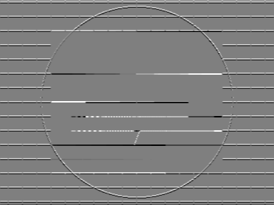

Filters
=======

Sobel Operator
--------------

### X-Gradient

This is an example on how to compute the Sobel x-gradient. A correlation of the input image with the following separable filter is performed.

    require 'rubygems'
    require 'hornetseye_rmagick'
    require 'hornetseye_xorg'
    include Hornetseye
    img = MultiArray.load_ubyte 'http://www.wedesoft.demon.co.uk/hornetseye-api/images/grey.png'
    img.sobel( 0 ).normalise.show

### Y-Gradient

This is an example on how to compute the Sobel y-gradient. A correlation of the input image with the following separable filter is performed.

    require 'rubygems'
    require 'hornetseye_rmagick'
    require 'hornetseye_xorg'
    include Hornetseye
    img = MultiArray.load_ubyte 'http://www.wedesoft.demon.co.uk/hornetseye-api/images/grey.png'
    img.sobel( 1 ).normalise.show

Gaussian Blur
-------------

This is an example on how to apply a Gauss blur filter. The filter can be applied to colour images as well.

    require 'rubygems'
    require 'hornetseye_rmagick'
    require 'hornetseye_xorg'
    include Hornetseye
    img = MultiArray.load_ubytergb 'http://www.wedesoft.demon.co.uk/hornetseye-api/images/lena.jpg'
    img.gauss_blur( 3.0 ).show

Van Cittert Deconvolution
-------------------------

Van Cittert deconvolution is an iterative algorithm for reversing a convolution with a known point spread function. To demonstrate the algorithm, the result of the Gaussian blur is used. The Van Cittert algorithm then is applied to this image to estimate the original input image. The first iteration of the algorithm uses the blurred image as an estimate.

    require 'rubygems'
    require 'hornetseye_rmagick'
    require 'hornetseye_xorg'
    include Hornetseye
    SIGMA = 3.0
    N = 20
    img = MultiArray.load_ubytergb( 'http://www.wedesoft.demon.co.uk/hornetseye-api/images/lena.jpg' ).gauss_blur( SIGMA ).to_ubytergb
    g = img.to_sfloatrgb
    N.times { g = img + g - g.gauss_blur( SIGMA ) }
    g.clip.show

Wiener Filter
-------------

Gauss Gradient
--------------

### X-Gradient

### Y-Gradient

Custom Filters
--------------

Connected Components Labeling
-----------------------------

See Also
--------

* {Hornetseye::Operations#convolve}
* {Hornetseye::Operations#sobel}

External Links
--------------

* [Sobel operator](http://en.wikipedia.org/wiki/Sobel_operator)

