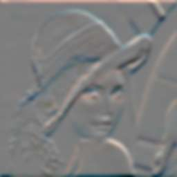

Filters
=======

Sobel Operator
--------------

### X-Gradient

This is an example on how to compute the Sobel x-gradient. A correlation of the input image with the following separable filter is performed.

    require 'rubygems'
    require 'hornetseye_rmagick'
    require 'hornetseye_xorg'
    include Hornetseye
    img = MultiArray.load_ubyte 'http://www.wedesoft.demon.co.uk/hornetseye-api/images/grey.png'
    img.sobel( 0 ).normalise.show

### Y-Gradient

This is an example on how to compute the Sobel y-gradient. A correlation of the input image with the following separable filter is performed.

    require 'rubygems'
    require 'hornetseye_rmagick'
    require 'hornetseye_xorg'
    include Hornetseye
    img = MultiArray.load_ubyte 'http://www.wedesoft.demon.co.uk/hornetseye-api/images/grey.png'
    img.sobel( 1 ).normalise.show

Gaussian Blur
-------------

This is an example on how to apply a Gauss blur filter. The filter can be applied to colour images as well.

    require 'rubygems'
    require 'hornetseye_rmagick'
    require 'hornetseye_xorg'
    include Hornetseye
    img = MultiArray.load_ubytergb 'http://www.wedesoft.demon.co.uk/hornetseye-api/images/lena.jpg'
    img.gauss_blur( 3.0 ).show

Van Cittert Deconvolution
-------------------------

Van Cittert deconvolution is an iterative algorithm for reversing a convolution with a known point spread function. To demonstrate the algorithm, the result of the Gaussian blur is used. The Van Cittert algorithm then is applied to this image to estimate the original input image. The first iteration of the algorithm uses the blurred image as an estimate.

    require 'rubygems'
    require 'hornetseye_rmagick'
    require 'hornetseye_xorg'
    include Hornetseye
    SIGMA = 3.0
    N = 20
    img = MultiArray.load_ubytergb( 'http://www.wedesoft.demon.co.uk/hornetseye-api/images/lena.jpg' ).gauss_blur( SIGMA ).to_ubytergb
    g = img.to_sfloatrgb
    N.times { g = img + g - g.gauss_blur( SIGMA ) }
    g.clip.show

Wiener Filter
-------------

Gauss Gradient
--------------

### X-Gradient

This is an example on how to compute the Gaussian x-gradient.

    require 'rubygems'
    require 'hornetseye_rmagick'
    require 'hornetseye_xorg'
    include Hornetseye
    img = MultiArray.load_ubytergb 'http://www.wedesoft.demon.co.uk/hornetseye-api/images/lena.jpg'
    img.gauss_gradient( 3.0, 0 ).normalise.show

### Y-Gradient

This is an example on how to compute the Gaussian y-gradient.

    require 'rubygems'
    require 'hornetseye_rmagick'
    require 'hornetseye_xorg'
    include Hornetseye
    img = MultiArray.load_ubytergb 'http://www.wedesoft.demon.co.uk/hornetseye-api/images/lena.jpg'
    img.gauss_gradient( 3.0, 1 ).normalise.show

Custom Filters
--------------

    +------+------+------+
    |  -k  |  -k  |  -k  |
    +------+------+------+
    |  -k  | 8k+1 |  -k  |
    +------+------+------+
    |  -k  |  -k  |  -k  |
    +------+------+------+

HornetsEye supports fast convolution with custom filters. In this example a 3x3 sharpness filter is created and used to sharpen the input image (here k=0.4). Note that the filter in this example is not separable. If your filter is separable you should exploit this to improve the speed of the filtering operation.

    require 'rubygems'
    require 'hornetseye_rmagick'
    require 'hornetseye_xorg'
    include Hornetseye
    K = 0.4
    filter = MultiArray[ [ -K, -K, -K ], [ -K,  8 * K + 1, -K ], [ -K, -K, -K ] ]
    img = MultiArray.load_ubytergb 'http://www.wedesoft.demon.co.uk/hornetseye-api/images/lena.jpg'
    result = img.convolve filter
    result.clip.show

Connected Components Labeling
-----------------------------

Connected component analysis assigns the same label to neighbouring pixel which have the same value.

    require 'rubygems'
    require 'hornetseye_rmagick'
    require 'hornetseye_xorg'
    include Hornetseye
    img = MultiArray.load_ubyte 'http://www.wedesoft.demon.co.uk/hornetseye-api/images/letters.png'
    components = ( img >= 0x7F ).components
    palette = Sequence.ubytergb components.max + 1
    palette.r, palette.g, palette.b = *( 1 .. 3 ).collect do
      Sequence( UBYTE, palette.size ).random 256
    end
    palette[ 0 ] = 0
    components.lut( palette ).show

See Also
--------

* {Hornetseye::Operations#convolve}
* {Hornetseye::Operations#sobel}
* {Hornetseye::Operations#components}

External Links
--------------

* [Sobel operator](http://en.wikipedia.org/wiki/Sobel_operator)
* [Unsharp masking](http://en.wikipedia.org/wiki/Unsharp_masking)
* [Connected component labeling](http://en.wikipedia.org/wiki/Connected_Component_Labeling)

