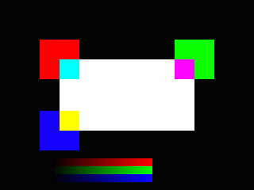

Interactive Ruby Shell
======================

Starting IRB
------------

You can develop machine vision algorithms using the **Interactive Ruby Shell**. Simply
start the shell like this:

    irb

You can put frequently used command into the file `$HOME/.irbrc`. It is useful to load Ruby Gems, IRB command line completion, and syntax highlighting (see {file:docs/FAQ.md FAQ} for more information on *wirble*).

    require 'irb/completion'
    require 'wirble'
    Wirble.init( { :skip_prompt => true } )
    Wirble.colorize

Example Session
---------------

Here is a small example session. The comments (lines preceded with '#') show the textual output returned by each command. The textual output can be useful for understanding the effect each operation has on the image.

    # false
    require 'multiarray'
    # true
    require 'hornetseye_xorg'
    # true
    include Hornetseye
    # Object
    m = MultiArray.new( UBYTERGB, 640, 480 ).fill! 0
    # MultiArray(UBYTERGB,640,480):
    # [ [ RGB(0,0,0), RGB(0,0,0), RGB(0,0,0), RGB(0,0,0), RGB(0,0,0), .... ],
    #   [ RGB(0,0,0), RGB(0,0,0), RGB(0,0,0), RGB(0,0,0), RGB(0,0,0), .... ],
    #   [ RGB(0,0,0), RGB(0,0,0), RGB(0,0,0), RGB(0,0,0), RGB(0,0,0), .... ],
    #   [ RGB(0,0,0), RGB(0,0,0), RGB(0,0,0), RGB(0,0,0), RGB(0,0,0), .... ],
    #   [ RGB(0,0,0), RGB(0,0,0), RGB(0,0,0), RGB(0,0,0), RGB(0,0,0), .... ],
    #   [ RGB(0,0,0), RGB(0,0,0), RGB(0,0,0), RGB(0,0,0), RGB(0,0,0), .... ],
    #   [ RGB(0,0,0), RGB(0,0,0), RGB(0,0,0), RGB(0,0,0), RGB(0,0,0), .... ],
    #   [ RGB(0,0,0), RGB(0,0,0), RGB(0,0,0), RGB(0,0,0), RGB(0,0,0), .... ],
    #   [ RGB(0,0,0), RGB(0,0,0), RGB(0,0,0), RGB(0,0,0), RGB(0,0,0), .... ],
    #   [ RGB(0,0,0), RGB(0,0,0), RGB(0,0,0), RGB(0,0,0), RGB(0,0,0), .... ],
    #   ....
    m[ 100 ... 200, 100 ... 200 ] = RGB( 255, 0, 0 )
    # RGB(255,0,0)
    m[ 440 ... 540, 100 ... 200 ] = RGB( 0, 255, 0 )
    # RGB(0,255,0)
    m[ 100 ... 200, 280 ... 380 ] = RGB( 0, 0, 255 )
    # RGB(0,0,255)
    box = [ 150 ... 490, 150 ... 330 ]
    # [150....490, 150....330]
    m[ *box ] = 255 - m[ *box ]
    # [150....490, 150....330, MultiArray(UBYTERGB,340,180):
    # [ [ RGB(0,255,255), RGB(0,255,255), RGB(0,255,255), .... ],
    #   [ RGB(0,255,255), RGB(0,255,255), RGB(0,255,255), .... ],
    #   [ RGB(0,255,255), RGB(0,255,255), RGB(0,255,255), .... ],
    #   [ RGB(0,255,255), RGB(0,255,255), RGB(0,255,255), .... ],
    #   [ RGB(0,255,255), RGB(0,255,255), RGB(0,255,255), .... ],
    #   [ RGB(0,255,255), RGB(0,255,255), RGB(0,255,255), .... ],
    #   [ RGB(0,255,255), RGB(0,255,255), RGB(0,255,255), .... ],
    #   [ RGB(0,255,255), RGB(0,255,255), RGB(0,255,255), .... ],
    #   [ RGB(0,255,255), RGB(0,255,255), RGB(0,255,255), .... ],
    #   [ RGB(0,255,255), RGB(0,255,255), RGB(0,255,255), .... ],
    #   ....]
    m[ 128 ... 384, 400 ... 420 ].r = lazy( 256, 20 ) { |i,j| i }
    # MultiArray(INT,256,20):
    # [ [ 0, 1, 2, 3, 4, 5, 6, 7, 8, 9, 10, 11, 12, 13, 14, 15, 16, 17, .... ],
    #   [ 0, 1, 2, 3, 4, 5, 6, 7, 8, 9, 10, 11, 12, 13, 14, 15, 16, 17, .... ],
    #   [ 0, 1, 2, 3, 4, 5, 6, 7, 8, 9, 10, 11, 12, 13, 14, 15, 16, 17, .... ],
    #   [ 0, 1, 2, 3, 4, 5, 6, 7, 8, 9, 10, 11, 12, 13, 14, 15, 16, 17, .... ],
    #   [ 0, 1, 2, 3, 4, 5, 6, 7, 8, 9, 10, 11, 12, 13, 14, 15, 16, 17, .... ],
    #   [ 0, 1, 2, 3, 4, 5, 6, 7, 8, 9, 10, 11, 12, 13, 14, 15, 16, 17, .... ],
    #   [ 0, 1, 2, 3, 4, 5, 6, 7, 8, 9, 10, 11, 12, 13, 14, 15, 16, 17, .... ],
    #   [ 0, 1, 2, 3, 4, 5, 6, 7, 8, 9, 10, 11, 12, 13, 14, 15, 16, 17, .... ],
    #   [ 0, 1, 2, 3, 4, 5, 6, 7, 8, 9, 10, 11, 12, 13, 14, 15, 16, 17, .... ],
    #   [ 0, 1, 2, 3, 4, 5, 6, 7, 8, 9, 10, 11, 12, 13, 14, 15, 16, 17, .... ],
    #   ....
    m[ 128 ... 384, 420 ... 440 ].g = lazy( 256, 20 ) { |i,j| i }
    # MultiArray(INT,256,20):
    # [ [ 0, 1, 2, 3, 4, 5, 6, 7, 8, 9, 10, 11, 12, 13, 14, 15, 16, 17, .... ],
    #   [ 0, 1, 2, 3, 4, 5, 6, 7, 8, 9, 10, 11, 12, 13, 14, 15, 16, 17, .... ],
    #   [ 0, 1, 2, 3, 4, 5, 6, 7, 8, 9, 10, 11, 12, 13, 14, 15, 16, 17, .... ],
    #   [ 0, 1, 2, 3, 4, 5, 6, 7, 8, 9, 10, 11, 12, 13, 14, 15, 16, 17, .... ],
    #   [ 0, 1, 2, 3, 4, 5, 6, 7, 8, 9, 10, 11, 12, 13, 14, 15, 16, 17, .... ],
    #   [ 0, 1, 2, 3, 4, 5, 6, 7, 8, 9, 10, 11, 12, 13, 14, 15, 16, 17, .... ],
    #   [ 0, 1, 2, 3, 4, 5, 6, 7, 8, 9, 10, 11, 12, 13, 14, 15, 16, 17, .... ],
    #   [ 0, 1, 2, 3, 4, 5, 6, 7, 8, 9, 10, 11, 12, 13, 14, 15, 16, 17, .... ],
    #   [ 0, 1, 2, 3, 4, 5, 6, 7, 8, 9, 10, 11, 12, 13, 14, 15, 16, 17, .... ],
    #   [ 0, 1, 2, 3, 4, 5, 6, 7, 8, 9, 10, 11, 12, 13, 14, 15, 16, 17, .... ],
    #   ....
    m[ 128 ... 384, 440 ... 460 ].b = lazy( 256, 20 ) { |i,j| i }
    # MultiArray(INT,256,20):
    # [ [ 0, 1, 2, 3, 4, 5, 6, 7, 8, 9, 10, 11, 12, 13, 14, 15, 16, 17, .... ],
    #   [ 0, 1, 2, 3, 4, 5, 6, 7, 8, 9, 10, 11, 12, 13, 14, 15, 16, 17, .... ],
    #   [ 0, 1, 2, 3, 4, 5, 6, 7, 8, 9, 10, 11, 12, 13, 14, 15, 16, 17, .... ],
    #   [ 0, 1, 2, 3, 4, 5, 6, 7, 8, 9, 10, 11, 12, 13, 14, 15, 16, 17, .... ],
    #   [ 0, 1, 2, 3, 4, 5, 6, 7, 8, 9, 10, 11, 12, 13, 14, 15, 16, 17, .... ],
    #   [ 0, 1, 2, 3, 4, 5, 6, 7, 8, 9, 10, 11, 12, 13, 14, 15, 16, 17, .... ],
    #   [ 0, 1, 2, 3, 4, 5, 6, 7, 8, 9, 10, 11, 12, 13, 14, 15, 16, 17, .... ],
    #   [ 0, 1, 2, 3, 4, 5, 6, 7, 8, 9, 10, 11, 12, 13, 14, 15, 16, 17, .... ],
    #   [ 0, 1, 2, 3, 4, 5, 6, 7, 8, 9, 10, 11, 12, 13, 14, 15, 16, 17, .... ],
    #   [ 0, 1, 2, 3, 4, 5, 6, 7, 8, 9, 10, 11, 12, 13, 14, 15, 16, 17, .... ],
    #   ....
    m.show
    # MultiArray(UBYTERGB,640,480):
    # [ [ RGB(0,0,0), RGB(0,0,0), RGB(0,0,0), RGB(0,0,0), RGB(0,0,0), .... ],
    #   [ RGB(0,0,0), RGB(0,0,0), RGB(0,0,0), RGB(0,0,0), RGB(0,0,0), .... ],
    #   [ RGB(0,0,0), RGB(0,0,0), RGB(0,0,0), RGB(0,0,0), RGB(0,0,0), .... ],
    #   [ RGB(0,0,0), RGB(0,0,0), RGB(0,0,0), RGB(0,0,0), RGB(0,0,0), .... ],
    #   [ RGB(0,0,0), RGB(0,0,0), RGB(0,0,0), RGB(0,0,0), RGB(0,0,0), .... ],
    #   [ RGB(0,0,0), RGB(0,0,0), RGB(0,0,0), RGB(0,0,0), RGB(0,0,0), .... ],
    #   [ RGB(0,0,0), RGB(0,0,0), RGB(0,0,0), RGB(0,0,0), RGB(0,0,0), .... ],
    #   [ RGB(0,0,0), RGB(0,0,0), RGB(0,0,0), RGB(0,0,0), RGB(0,0,0), .... ],
    #   [ RGB(0,0,0), RGB(0,0,0), RGB(0,0,0), RGB(0,0,0), RGB(0,0,0), .... ],
    #   [ RGB(0,0,0), RGB(0,0,0), RGB(0,0,0), RGB(0,0,0), RGB(0,0,0), .... ],
    #   ....

See Also
--------
* {file:docs/FAQ.md Frequently Asked Questions}

External Links
--------------

* [Interactive Ruby Shell](http://en.wikipedia.org/wiki/Interactive_Ruby_Shell)
* [Try Ruby](http://tryruby.org/)

