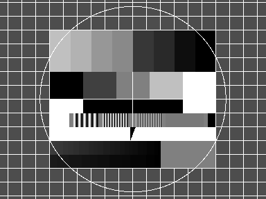

Read Grey Scale Image
=====================

This example shows how to load and display a grey scale image.  HornetsEye makes use of [RMagick](http://rmagick.rubyforge.org/). RMagick supports virtually any image file format.  If the image is a colour image, it is converted to greyscale.

    require 'rubygems'
    require 'hornetseye_rmagick'
    require 'hornetseye_xorg'
    include Hornetseye
    img = MultiArray.load_ubyte 'test.jpg'
    img.show

