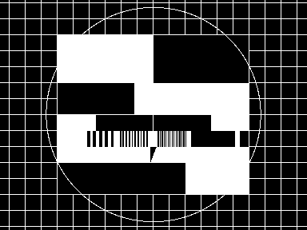

Element-wise Operations
=======================

Invert Image
------------

Greyscale as well as colour images can be inverted. This example shows how to do this.

    require 'rubygems'
    require 'hornetseye_rmagick'
    require 'hornetseye_xorg'
    include Hornetseye
    img = MultiArray.load_ubytergb 'http://www.wedesoft.demon.co.uk/hornetseye-api/images/colour.png'
    ( 255 - img ).show

Thresholding
------------

This example shows how to apply a threshold to an image. Since the result is a boolean image, it needs to be converted using the conditional function before it can be displayed.

    require 'rubygems'
    require 'hornetseye_rmagick'
    require 'hornetseye_xorg'
    include Hornetseye
    img = MultiArray.load_ubyte 'http://www.wedesoft.demon.co.uk/hornetseye-api/images/grey.png'
    binary = img >= 128
    binary.conditional( 255, 0 ).show

Gamma correction
----------------

One can do gamma correction by applying an exponential function to each pixel.

    require 'rubygems'
    require 'hornetseye_openexr'
    require 'hornetseye_xorg'
    include Hornetseye
    img = MultiArray.load_sfloatrgb 'http://www.wedesoft.demon.co.uk/hornetseye-api/images/bmw.exr'
    ( img ** 0.03 ).normalise.show

Adjusting Brightness and Contrast
---------------------------------

Changing the brightness and/or contrast of an image simply means applying a gain and an offset to the image. The values need to be clamped before they can be displayed.

    require 'rubygems'
    require 'hornetseye_rmagick'
    require 'hornetseye_xorg'
    include Hornetseye
    img = MultiArray.load_ubytergb 'http://www.wedesoft.demon.co.uk/hornetseye-api/images/colour.png'
    n = 3
    w, h = *img.shape
    thumb = ( img.downsample( n, n ) / 255.0 ) ** 2.2
    result = MultiArray.ubytergb *thumb.shape.collect { |d| d * n }
    for y in 0 ... n
      for x in 0 ... n
        brightness = 2 * ( y + 0.5 ) / n - 1
        contrast = 2 * ( x + 0.5 ) / n - 1
        factor = ( contrast + 1.0 ) / ( 1.0 - contrast )
        offset = 0.5 * ( 1.0 + ( brightness -1.0 ) * factor )
        sample = thumb * factor + offset
        result[ w / n * x ... w / n * ( x + 1 ),
                h / n * y ... h / n * ( y + 1 ) ] = ( 255 * sample ** ( 1 / 2.2 ) ).clip
      end
    end
    result.show

Element-wise Logarithm
----------------------

The element-wise logarithm can be used to display images with a large contrast range.

    require 'rubygems'
    require 'hornetseye_openexr'
    require 'hornetseye_xorg'
    include Hornetseye
    img = MultiArray.load_sfloat 'http://www.wedesoft.demon.co.uk/hornetseye-api/images/bmw.exr'
    Math.log( img + 0.1 ).normalise.show

Pseudo Colours
--------------

You can create pseudo-colour images in real-time. The example program loads a single greyscale image and converts it to pseudo colour. Pseudo colour are often used to display IR images.

    require 'rubygems'
    require 'hornetseye_rmagick'
    require 'hornetseye_xorg'
    include Hornetseye
    class Numeric
      def clip( range )
        [ [ self, range.begin ].max, range.end ].min
      end
    end
    colours = Sequence.ubytergb 256
    for i in 0...256
      hue = 240 - i * 240.0 / 256.0
      colours[i] =
        RGB( ( ( hue - 180 ).abs -  60 ).clip( 0...60 ) * 0xFF / 60.0,
             ( 120 - ( hue - 120 ).abs ).clip( 0...60 ) * 0xFF / 60.0,
             ( 120 - ( hue - 240 ).abs ).clip( 0...60 ) * 0xFF / 60.0 )
    end
    img = MultiArray.load_ubyte 'http://www.wedesoft.demon.co.uk/hornetseye-api/images/world.jpg'
    img.lut( colours ).show

See Also
--------

* {file:docs/XOrg.md Displaying images}
* {file:docs/RMagick.md Loading and saving image files}

External Links
--------------

* [Colour negative](http://en.wikipedia.org/wiki/Negative_%28photography%29)
* [Thresholding](http://en.wikipedia.org/wiki/Thresholding_%28image_processing%29)
* [Palette](http://en.wikipedia.org/wiki/Palette_%28computing%29)

