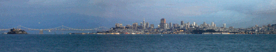
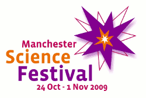
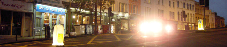
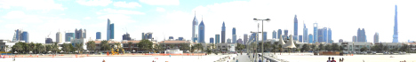

Publications
============

**HornetsEye** was presented on a couple of conferences already. Thanks to the anonymous reviewers for the helpful and inspiring comments.

7th ShRUG meeting
-----------------

**Hornetseye** was demonstrated at the [7th Sheffield Ruby User Group (ShRUG) meeting](http://shrug.org/meetings/shrug-7/) in Sheffield, United Kingdom ([presentation slides](http://www.wedesoft.demon.co.uk/shrug7.html)). Thanks to the organizers and thanks to the audience for attending.

RubyConf 2009
-------------

**HornetsEye** was presented at [RubyConf 2009](http://rubyconf.org/) in San Francisco, California ([presentation slides and video](http://www.wedesoft.demon.co.uk/rubyconf09video.html)). Thank you to the conference organizers for all their hard work and thanks to all the people for their feedback and encouragement.

Manchester Science Festival 2009
--------------------------------

**HornetsEye** was presented at the [Manchester Science Festival 2009](http://www.manchestersciencefestival.com/) as part of the "Walking with Robots" special exhibition.

AVA meeting at Bristol 2008
---------------------------

**HornetsEye** was presented at the [AVA meeting at Bristol 2008](http://hlsweb.dmu.ac.uk/ava/meetings/bristol2008.html) ([poster](http://vision.eng.shu.ac.uk/mmvlwiki/index.php/Image:AVA-Bristol-2008.jpg)).

OSCON 2008
----------

**HornetsEye** was presented at [OSCON 2008](http://en.oreilly.com/oscon2008/) in Portland, Oregon. The title of the talk was ["Real-time computer vision with Ruby"](http://en.oreilly.com/oscon2008/public/schedule/detail/2471) and it was part of the schedule of Ruby talks ([slides](http://assets.en.oreilly.com/1/event/12/Real-time%20Computer%20Vision%20with%20Ruby%20Presentation.pdf)). A big thank you to the conference organizers and thanks to the audience for the positive feedback and suggestions, thanks to all the people I met for the interesting conversations!

ICIA 2008
---------

**HornetsEye** was presented at [ICIA 2008](http://www.icia2008.org/) in Zhangjiajie (张家界) , China. The title of the publication is ["A Machine Vision Extension for the Ruby Programming Language"](http://shura.shu.ac.uk/952/) and a live demo of *HornetsEye* was given. A big thank you to the conference organizers and thanks to all the people who I met for the exciting conversations!

ICSPC 2007
----------

**HornetsEye** was presented at [ICSPC 2007](http://www.icspc07.org/) in Dubai (دبيّ), United Arab Emirates. The title of the publication is ["Steerable filters generated with the hypercomplex dual-tree wavelet transform"](http://shura.shu.ac.uk/953/) and *HornetsEye* was presented as part of the poster session. A big thank you to the conference organizers and thanks to all the people who I met for the interesting conversations!

