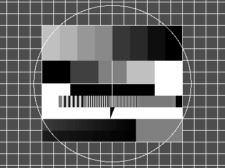
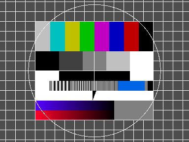

Loading and Saving Image Files
===============================

**HornetsEye** makes use of [RMagick](http://rmagick.rubyforge.org/). RMagick supports virtually any image file format. For loading and saving high dynamic range images, the [OpenEXR](http://www.openexr.com/) library is used.

Traditional Raster Formats
--------------------------

### Grey Scale Image

This example shows how to load, display, and save a grey scale image. If the image is a colour image, it is converted to grey scale on-the-fly.

    require 'rubygems'
    require 'hornetseye_rmagick'
    require 'hornetseye_xorg'
    include Hornetseye
    img = MultiArray.load_ubyte 'http://www.wedesoft.demon.co.uk/hornetseye-api/images/grey.png'
    img.show
    img.save_ubyte '/tmp/grey.png'

### Colour Image

This example shows how to load, display, and save a colour image. If the image is a grey scale image, the different colour channels will have the same values.

    require 'rubygems'
    require 'hornetseye_rmagick'
    require 'hornetseye_xorg'
    include Hornetseye
    img = MultiArray.load_ubytergb 'http://www.wedesoft.demon.co.uk/hornetseye-api/images/colour.png'
    img.show
    img.save_ubytergb '/tmp/colour.png'

### Swapping Colour Channels

The following example shows how one can swap the colour channels of an image using the method {Hornetseye::RGB#swap_rgb}.

    require 'rubygems'
    require 'hornetseye_rmagick'
    require 'hornetseye_xorg'
    include Hornetseye
    img = MultiArray.load_ubytergb 'http://www.wedesoft.demon.co.uk/hornetseye-api/images/colour.png'
    img.swap_rgb.show

High Dynamic Range Images
-------------------------

### Grey Scale Image

The values of a high dynamic range images usually exceed the range of the display. The example below scales the values of the image to an average of 256. The values are clipped before the result is displayed.

    require 'rubygems'
    require 'hornetseye_openexr'
    require 'hornetseye_xorg'
    include Hornetseye
    img = MultiArray.load_sfloat 'http://www.wedesoft.demon.co.uk/hornetseye-api/images/bmw.exr'
    average = img.sum / img.size
    ( 256 * img / average ).minor( 255 ).show

### Colour Image

The following example loads a colour HDR image, reduces the gamma, and then displays the normalised result.

    require 'rubygems'
    require 'hornetseye_openexr'
    require 'hornetseye_xorg'
    include Hornetseye
    img = MultiArray.load_sfloatrgb 'http://www.wedesoft.demon.co.uk/hornetseye-api/images/bmw.exr'
    ( img ** 0.1 ).normalise.show

See Also
--------

* {Hornetseye::MultiArray.load_ubyte}
* {Hornetseye::MultiArray.load_ubytergb}
* {Hornetseye::MultiArray.load_sfloat}
* {Hornetseye::MultiArray.load_sfloatrgb}
* {Hornetseye::Node#save_ubyte}
* {Hornetseye::Node#save_ubytergb}
* {Hornetseye::Node#save_sfloat}
* {Hornetseye::Node#save_sfloatrgb}

External Links
--------------

* [RMagick](http://rmagick.rubyforge.org/)
* [OpenEXR](http://www.openexr.com/)
* [High dynamic range imaging](http://en.wikipedia.org/wiki/High_dynamic_range_imaging)
* [Tonemapping](http://en.wikipedia.org/wiki/Tonemapping)

