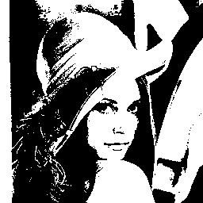
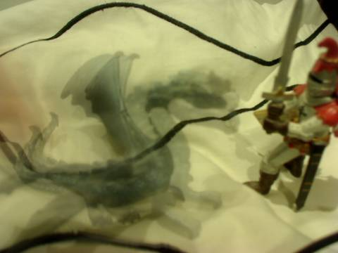
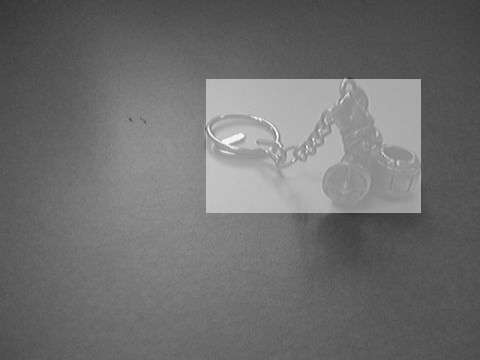
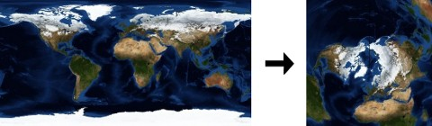
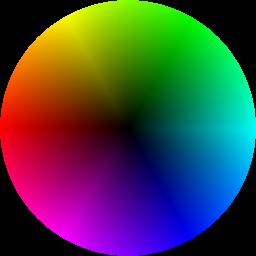
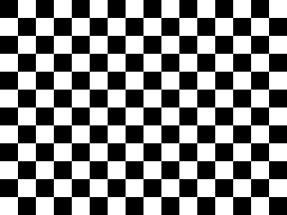
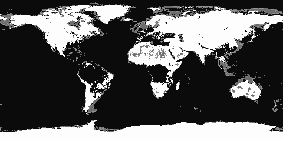
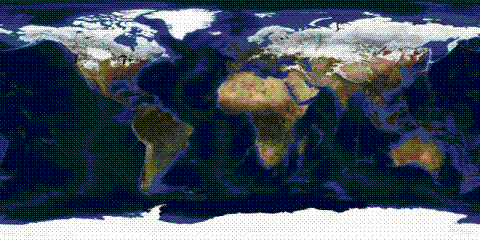

Histograms and Warps
====================

Histogram Equalisation
----------------------

Using integral arrays and element-wise lookup (map) one can implement histogram equalisation.

    require 'rubygems'
    require 'hornetseye_openexr'
    require 'hornetseye_xorg'
    include Hornetseye
    class Node
      def average
        sum / size
      end
      def equalise( n = 4096, c_max = 255 )
        if typecode < RGB_
          result = MultiArray(typecode, dimension).new *shape
          max_average = [ r, g, b ].collect { |c| c.average }.max
          result.r, result.g, result.b = *[ r, g, b ].collect do |c|
            c.equalise n, c_max * c.average / max_average
          end
          result
        else
          quantised = normalise( 0 .. n - 1 ).to_int
          quantised.lut quantised.histogram( n ).integral.normalise( 0 .. c_max )
        end
      end
    end
    system 'wget -c http://www.wedesoft.demon.co.uk/hornetseye-api/images/bmw.exr'
    img = MultiArray.load_sfloatrgb 'bmw.exr'
    img.equalise.show

Otsu Thresholding
-----------------

The Otsu algorithm is an algorithm for automatic thresholding. The algorithm assumes that the image to be thresholded contains two classes of pixels and then chooses the threshold which minimizes the intra-class variance of the two classes defined by the resulting binary image. Otsu has reformulated this problem so that it can be computed efficiently with histograms.

    require 'hornetseye_rmagick'
    require 'hornetseye_xorg'
    include Hornetseye
    class Node
      def otsu( hist_size = 256 )
        h = histogram hist_size
        w1 = h.integral
        w2 = w1[ w1.size - 1 ] - w1
        s1 = lazy { |i| h[i] * i }.integral
        s2 = sum - s1
        m1 = w1 > 0
        u1 = ( s1.mask( m1 ).to_sfloat / w1.mask( m1 ) ).unmask m1
        m2 = w2 > 0
        u2 = ( s2.mask( m2 ).to_sfloat / w2.mask( m2 ) ).unmask m2
        between_variance = ( u1 - u2 ) ** 2 * w1 * w2
        self > argmax { |i| between_variance[i] }.first
      end
    end
    img = MultiArray.load_ubyte 'http://www.wedesoft.demon.co.uk/hornetseye-api/images/lena.jpg'
    ( img.otsu.to_ubyte * 255 ).show

Compute Average
---------------

This example shows how to compute the average of a series of frames. You can use a program like this to reduce noise by averaging a large number of frames.

    require 'rubygems'
    require 'hornetseye_v4l2'
    require 'hornetseye_xorg'
    include Hornetseye
    input = V4L2Input.new
    average = nil
    c = 0
    img = X11Display.show do
      img = input.read_ubytergb
      average = average.nil? ? img.to_uintrgb : average + img
      c += 1
      average / c
    end
    img.show

Bounding Box
------------

A mask which specifies pixel locations of interest is created. The mask then is applied to an x-ramp and a y-ramp to find the bounding box. The area outside the bounding box finally is highlighted.

    require 'rubygems'
    require 'hornetseye_rmagick'
    require 'hornetseye_xorg'
    include Hornetseye
    img = MultiArray.load_ubyte 'http://www.wedesoft.demon.co.uk/hornetseye-api/images/viking.jpg'
    mask = img <= 50
    x = lazy( *img.shape ) { |i,j| i }
    y = lazy( *img.shape ) { |i,j| j }
    box = [ x.mask( mask ).range, y.mask( mask ).range ]
    img[ *box ] = img[ *box ] / 2 + 0x7F
    img.show

Warps
-----

Images can be warped using vector fields. The warp vectors are indicating the location of the source pixel. The example warps an equirectangular projection to an azimuthal projection.

    require 'rubygems'
    require 'hornetseye_rmagick'
    require 'hornetseye_xorg'
    include Hornetseye
    img = MultiArray.load_ubytergb 'http://www.wedesoft.demon.co.uk/hornetseye-api/images/world.jpg'
    w, h = *img.shape
    c = 0.5 * h
    x, y = lazy( h, h ) { |i,j| i - c }, lazy( h, h ) { |i,j| j - c }
    angle = ( Math.atan2( x, y ) / Math::PI + 1 ) * w / 2
    radius = Math.hypot( x, y )
    img.warp( angle.to_int, radius.to_int ).show

Colour Circle
-------------

You can create images yourself.  In this example an image with different colours is generated and the result is mapped to a circle using a vector-field.

    require 'rubygems'
    require 'hornetseye_xorg'
    include Hornetseye
    img = MultiArray.ubytergb( 360, 128 ).fill!
    x, y = lazy( *img.shape ) { |i,j| i }, lazy( *img.shape ) { |i,j| j }
    img.r = ( ( ( x - 180 ).abs -  60 ).clip( 0..60 ) * y ).normalise
    img.g = ( ( 120 - ( x - 120 ).abs ).clip( 0..60 ) * y ).normalise
    img.b = ( ( 120 - ( x - 240 ).abs ).clip( 0..60 ) * y ).normalise
    w, h = 256, 256
    x, y = lazy( w, h ) { |i,j| i - 127.5 }, lazy( w, h ) { |i,j| j - 127.5 }
    angle = Math.atan2( y, x ) * 180.0 / Math::PI + 179.5
    radius = Math.hypot( y, x )
    img.warp( angle.to_int, radius.to_int ).show

Chequerboard
------------

Index arrays can be used to create patterns. The following example shows how one can create a chequerboard pattern using modulo, division without remainder, exclusive-or, and multiplication.

    require 'hornetseye_xorg'
    include Hornetseye
    checker = finalise( 320, 240 ) do |i,j|
      ( ( ( i / 20 ) % 2 ) ^ ( ( j / 20 ) % 2 ) ) * 0xFF
    end
    checker.show

Histogram Segmentation
----------------------

This is an implementation of histogram inversion. Here a ratio-histogram of the target (land) and the background (water) is computed. Histogram inversion is used to highlight the areas of the image which are considered to be land.

    require 'rubygems'
    require 'hornetseye_rmagick'
    require 'hornetseye_xorg'
    include Hornetseye
    div = 0x40
    size = 0x100 / div
    img = MultiArray.load_ubytergb 'http://www.wedesoft.demon.co.uk/hornetseye-api/images/world.jpg'
    land = img[ 455 ... 525, 32 ... 116 ]
    water = img[ 33 ... 133, 172 ... 272 ]
    land_hist = ( land / div ).histogram( size, size, size ).to_int
    water_hist = ( water / div ).histogram( size, size, size ).to_int
    mask = ( land_hist + water_hist ) > 0
    quot = ( ( land_hist - water_hist ).mask( mask ).to_dfloat /
             ( land_hist + water_hist ).mask( mask ) ).unmask mask
    ( img / div ).lut( quot ).normalise.show

Ordered Dithering
-----------------

    +----+----+----+----+----+----+----+----+
    |  0 | 32 |  8 | 40 |  2 | 34 | 10 | 42 |
    +----+----+----+----+----+----+----+----+
    | 48 | 16 | 56 | 24 | 50 | 18 | 58 | 26 |
    +----+----+----+----+----+----+----+----+
    | 12 | 44 |  4 | 36 | 14 | 46 |  6 | 38 |
    +----+----+----+----+----+----+----+----+
    | 60 | 28 | 52 | 20 | 62 | 30 | 54 | 22 |
    +----+----+----+----+----+----+----+----+
    |  3 | 35 | 11 | 43 |  1 | 33 |  9 | 41 |
    +----+----+----+----+----+----+----+----+
    | 51 | 19 | 59 | 27 | 49 | 17 | 57 | 25 |
    +----+----+----+----+----+----+----+----+
    | 15 | 47 |  7 | 39 | 13 | 45 |  5 | 37 |
    +----+----+----+----+----+----+----+----+
    | 63 | 31 | 55 | 23 | 61 | 29 | 53 | 21 |
    +----+----+----+----+----+----+----+----+

This example demonstrates dithering using a Bayer matrix. Dithering is most commonly used for displaying images on hardware with a low colour depth. The algorithm modifies the input values using an index matrix before quantising them.

    require 'rubygems'
    require 'hornetseye_rmagick'
    require 'hornetseye_xorg'
    include Hornetseye
    class MultiArray
      class << self
        def bayer(lsize)
          n = 1 << lsize
          idx = MultiArray(INT, 2).indgen n, n
          result = MultiArray.int(n, n).fill!
          m = Sequence[0, 2, 3, 1].to_int
          for i in 0 ... lsize
            q = idx.bit(i) | idx.bit(i + lsize) << 1
            result |= q.lut(m) << ((lsize - i - 1) << 1)
          end
          result
        end
      end
    end
    class Node
      def bit( i )
        (self & (1 << i)) >> i
      end
      def dither(lsize = 4)
        if typecode < RGB_
          result = MultiArray(typecode, dimension).new *shape
          result.r, result.g, result.b = [r, g, b].collect do |c|
            c.dither lsize
          end
          result
        else
          bayer = MultiArray.bayer lsize
          x = lazy(*shape) { |i,j| i & ((1 << lsize) - 1) }
          y = lazy(*shape) { |i,j| j & ((1 << lsize) - 1) }
          msk = (1 << lsize) ** 2 - 1
          (self & msk <= bayer.warp(x, y)).conditional self & ~msk, self | msk
        end
      end
    end
    img = MultiArray.load_ubytergb 'http://www.wedesoft.demon.co.uk/hornetseye-api/images/world.jpg'
    img.dither(3).show

See Also
--------

* {Hornetseye#lazy}
* {Hornetseye#finalise}
* {Hornetseye::Node#lut}
* {Hornetseye::Node#histogram}
* {Hornetseye::Node#integral}
* {Hornetseye::Node#mask}
* {Hornetseye::Node#warp}

External Links
--------------

* [Histogram equalisation](http://en.wikipedia.org/wiki/Histogram_Equalization)
* [Image warping](http://en.wikipedia.org/wiki/Image_warping)
* [Ordered dithering](http://en.wikipedia.org/wiki/Ordered_dithering)

