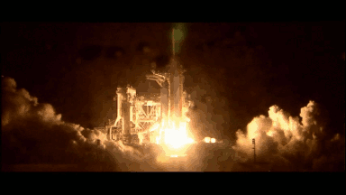

Displaying Images
=================

XImage display
--------------

Display using {Hornetseye::XImageOutput} should work any X.Org true colour display. This display mode is used by default.

    require 'rubygems'
    require 'hornetseye_rmagick'
    require 'hornetseye_xorg'
    include Hornetseye
    img = MultiArray.load_ubytergb 'http://www.wedesoft.demon.co.uk/hornetseye-api/images/colour.png'
    img.show

OpenGL display
--------------

One can use {Hornetseye::OpenGLOutput} to use OpenGL hardware acceleration (*glDrawPixels* to be more exact). OpenGL also works on displays other than true colour. However OpenGL is not always supported and it can interfere with compositing window managers.

    require 'rubygems'
    require 'hornetseye_rmagick'
    require 'hornetseye_xorg'
    include Hornetseye
    img = MultiArray.load_ubytergb 'http://www.wedesoft.demon.co.uk/hornetseye-api/images/colour.png'
    img.show :output => OpenGLOutput

XVideo display
--------------

{Hornetseye::XVideoOutput} provides hardware accelerated video display. Note that XVideo is not supported by some graphic cards. Usually it is not possible to have more than one window using XVideo display at the same time. XVideo is usually used to display videos.

    require 'rubygems'
    require 'hornetseye_ffmpeg'
    require 'hornetseye_xorg'
    include Hornetseye
    input = AVInput.new 'http://anon.nasa-global.edgesuite.net/anon.nasa-global/NASAHD/sts-116/STS-116_LaunchHD_480p.wmv'
    X11Display.show :frame_rate => input.frame_rate, :output => XVideoOutput do
      input.read
    end

Multiple Windows
----------------

The simple API shown above is not sufficient for handling multiple windows. If more than one window is required for display, one can use the lower level API to do so. The following example displays multiple windows with the colour channels of a video.

    require 'rubygems'
    require 'hornetseye_xorg'
    require 'hornetseye_ffmpeg'
    include Hornetseye
    input = AVInput.new 'http://mirrorblender.top-ix.org/movies/sintel-1024-surround.mp4'
    dt = 1.0 / input.frame_rate
    width, height = input.width, input.height
    p width
    p height
    display = X11Display.new
    output = (0 ... 4).collect { XImageOutput.new }
    window = output.collect { |o| X11Window.new display, o, width, height }
    window.zip( [ 'Video', 'Red', 'Green', 'Blue' ] ).collect { |w,title| w.title = title }
    window.each { |w| w.show }
    t = Time.new.to_f
    while display.status?
      img = input.read_ubytergb
      output[0].write img
      output[1].write img.r
      output[2].write img.g
      output[3].write img.b
      display.event_loop [ t + dt - Time.new.to_f, 0 ].max
      t += dt
    end
    window.each { |w| w.close }

See Also
--------

* {Hornetseye::X11Display}
* {Hornetseye::X11Window}
* {Hornetseye::XImageOutput}
* {Hornetseye::OpenGLOutput}
* {Hornetseye::XVideoOutput}

External Links
--------------

* [X.Org](http://www.x.org/)
* [Nasa High Definition videos](http://www.nasa.gov/multimedia/hd/)

